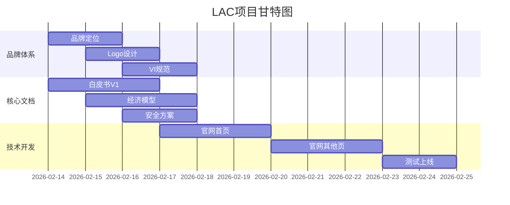

# 第三篇章：实战兵法——从脑洞到落地的全链路

> *"军团组建完毕，是时候真刀真枪上战场了。"*

前两个篇章解决了"认知"和"组织"的问题。这一篇章是全书最核心的"干货区"——我们将从项目蓝图的构建、到日常生产的工业化流程、再到指挥中心的搭建，完整展示"一个想法如何在10天内变成现实"的全过程。

---

## 第7章：WBS蓝图——把脑洞变成机器语言

### 什么是WBS？为什么在1+10模式下它如此重要？

WBS（Work Breakdown Structure，工作分解结构）是项目管理中最基础也最重要的工具之一。它的核心理念很简单：**把一个大项目分解成可管理、可追踪、可分配的最小工作单元。**

为什么在1+10模式下WBS特别重要？

因为AI是"优秀的执行者，但糟糕的规划者"。如果你给AI一个模糊的大任务（"帮我做个网站"），AI会做出一个"看似完整但到处有洞"的东西。但如果你给AI一个精确的小任务（"用Next.js开发一个响应式的导航栏组件，高度64px，包含Logo和4个导航链接"），AI能做得非常好。

WBS就是把"帮我做个网站"变成100个"精确小任务"的过程。

### 真实的WBS拆解全过程：从CEO一句话到蜂群执行

让我带你完整走一遍LAC项目从CEO一句话到蜂群执行的完整WBS拆解过程。这是实战，不是理论。

#### 第一步：CEO一句话（战略意图）

**时间：2026年2月14日 18:00**
**地点：新加坡，20平米房间**
**CEO（我）在Telegram群里说：**

> "我们要在10天内完成LAC的全套基础建设，包括：品牌VI、白皮书、Token经济模型、官网、安全方案。目标是达到种子轮融资路演的标准。"

这句话包含了：
- **时间约束**：10天
- **范围**：品牌VI、白皮书、Token经济模型、官网、安全方案
- **质量标准**：种子轮融资路演标准
- **隐含要求**：专业、完整、可信

#### 第二步：蜂王理解（意图深度解析）

**时间：18:00-18:03**
**蜂王（小嘀嗒）收到指令后，开始深度解析：**

蜂王不是简单转发，而是做了以下分析：

1. **拆解关键词**：
   - "品牌VI" = Logo + 色板 + 字体 + 视觉规范
   - "白皮书" = 项目介绍 + 技术架构 + 经济模型 + 路线图
   - "Token经济模型" = 代币分配 + 流通机制 + 激励设计
   - "官网" = 前端开发 + 后端API + 部署上线
   - "安全方案" = 智能合约审计 + 前端安全 + 数据安全

2. **识别依赖关系**：
   - 官网开发需要品牌VI（视觉规范）
   - 白皮书需要Token经济模型（数据一致）
   - 安全方案需要技术架构（知道要审计什么）

3. **估算工作量**：
   - 品牌VI：2-3天（需要CEO审美决策）
   - 白皮书：3-4天（需要多次迭代）
   - Token经济模型：2-3天（需要数学计算）
   - 官网：5-7天（开发+测试）
   - 安全方案：2-3天（需要技术细节）

4. **识别风险点**：
   - 品牌VI的主观性强，可能返工
   - Token经济模型需要CEO的价值观决策
   - 官网开发可能遇到技术难题

#### 第三步：蜂王拆解（生成WBS初稿）

**时间：18:03-18:08**
**蜂王生成第一版WBS（76个任务单元，这里展示核心部分）：**

```
LAC项目 · 10天冲刺 · WBS v1.0
================================

Level 1: LAC平台建设（10天）
├── Level 2: 品牌体系（Day 1-3）
│   ├── Level 3: 品牌定位（CEO+蜂王）
│   │   ├── 品牌价值观定义（CEO决策）
│   │   ├── 目标用户画像（蜂王分析）
│   │   └── 竞品差异化分析（链鹰）
│   ├── Level 3: VI视觉系统（设计师）
│   │   ├── Logo设计（3选1方案）
│   │   ├── 色板定义（主色+强调色+辅助色）
│   │   ├── 字体规范（标题/正文/代码）
│   │   └── 视觉元素库（图标+插图风格）
│   └── Level 3: 品牌叙事（墨笔）
│       ├── 品牌故事（创始人叙事）
│       ├── Slogan定稿（3选1）
│       └── 品牌调性指南（文案风格）
├── Level 2: 核心文档（Day 1-4）
│   ├── Level 3: 白皮书（经济师+墨笔）
│   │   ├── 执行摘要（1页精华）
│   │   ├── 项目介绍（问题+解决方案）
│   │   ├── 技术架构（链鹰+小技）
│   │   ├── Token经济模型（经济师）
│   │   ├── 路线图（CEO决策）
│   │   └── 团队介绍（CEO提供）
│   ├── Level 3: Token经济模型（经济师）
│   │   ├── 代币分配比例（CEO决策）
│   │   ├── 流通机制设计（释放曲线）
│   │   ├── 激励模型（4维挖矿）
│   │   └── 经济模拟（蒙特卡罗）
│   ├── Level 3: 竞品分析（链鹰）
│   │   ├── 竞品筛选（5个核心）
│   │   ├── 深度分析（机制+数据）
│   │   └── 差异化定位（LAC优势）
│   └── Level 3: 安全方案（小黑）
│       ├── 智能合约审计清单
│       ├── 前端安全规范
│       └── 数据隐私方案
├── Level 2: 技术开发（Day 3-8）
│   ├── Level 3: 官网开发（小小技+小技）
│   │   ├── 技术栈选型（Next.js + Tailwind）
│   │   ├── 页面结构设计（5个核心页面）
│   │   ├── 前端开发（逐页实现）
│   │   ├── 响应式适配（3个断点）
│   │   └── 性能优化（Lighthouse 90+）
│   ├── Level 3: 智能合约（链鹰+小黑）
│   │   ├── 合约架构设计（Solana）
│   │   ├── 核心功能实现（代币+挖矿）
│   │   └── 单元测试（覆盖率90%+）
│   └── Level 3: 部署上线（小技）
│       ├── 生产环境配置
│       ├── CI/CD流水线
│       └── 监控告警设置
├── Level 2: 商业化（Day 4-7）
│   ├── Level 3: 收入模型（财奴）
│   │   ├── 收入预测（3年）
│   │   ├── 成本结构分析
│   │   └── 盈亏平衡点计算
│   └── Level 3: BD策略（财奴）
│       ├── 合作伙伴画像
│       ├── 合作模式设计
│       └── 谈判要点清单
└── Level 2: 运营推广（Day 8-10）
    ├── Level 3: 内容矩阵（墨笔）
    │   ├── 社交媒体内容日历
    │   ├── 社区运营SOP
    │   └── 用户教育材料
    └── Level 3: 上线准备（蜂王+全员）
        ├── 上线检查清单
        ├── 应急预案
        └── 发布公告文案
```

#### 第四步：CEO审核调整

**时间：18:08-18:20**
**我（CEO）审核蜂王的WBS，做了以下关键调整：**

1. **优先级调整**：
   - 把"品牌VI"提到最高优先级（Day 1-2必须完成）
   - 因为官网开发依赖VI规范，不能等

2. **依赖关系修正**：
   - 官网开发必须在VI完成后开始（原WBS允许并行）
   - 安全方案必须在技术架构确定后开始

3. **资源分配优化**：
   - 设计师Agent同时负责Logo和VI，负荷太重
   - 拆分：设计师负责视觉，墨笔负责文案

4. **风险点补充**：
   - 增加"模型备用方案"（防止API宕机）
   - 增加"每日Token消耗监控"

5. **验收标准细化**：
   - 每个任务单元都加上明确的验收标准
   - 比如"Logo设计：3选1方案，CEO最终决策"

#### 第五步：蜂王细化分发

**时间：18:20-18:30**
**蜂王将Level 3任务进一步拆解为Level 4的可执行单元，并为每个任务编写像素级Prompt：**

以"Logo设计"任务为例，蜂王给设计师Agent的Prompt：

```markdown
## 任务：LAC Logo设计 · V1.0

### 目标
设计LAC（Love AI Club）的Logo，传达"科技+人文关怀"的品牌调性。

### 品牌背景
- LAC = Love AI Club，一个Web3社交平台
- 核心理念：让AI帮助人类拥抱变革
- 目标用户：AI爱好者、开发者、创作者
- 竞品参考：Linear（科技感）、Notion（温暖感）

### 具体要求
1. **风格要求**：
   - 科技感但不冰冷
   - 简洁但有记忆点
   - 适合Web3场景

2. **设计元素**：
   - 必须包含"LAC"字母组合
   - 可以加入AI相关元素（脑图、神经元、代码）
   - 可以加入爱心元素（呼应"Love"）

3. **技术参数**：
   - 格式：SVG + PNG（透明背景）
   - 尺寸：180×60px（Header用）+ 512×512px（大图）
   - 颜色：先用黑白稿，色板后续确定

4. **交付要求**：
   - 3个不同方向的设计方案
   - 每个方案附设计理念说明（100字以内）
   - SVG文件必须可编辑（无栅格化）

### 验收标准
- 3个方案风格差异明显（不能只是微调）
- 每个方案都有清晰的核心理念
- SVG文件在Figma/Illustrator中可编辑
- 黑白稿在深色/浅色背景上都清晰

### 禁止事项
- 不要用过于复杂的渐变
- 不要用纯几何图形（太冰冷）
- 不要抄袭现有知名Logo

### 时间要求
- 开始时间：现在
- 预计耗时：4小时
- 交付时间：22:30前
```

#### 第六步：蜂群执行

**时间：18:30开始**
**蜂王开始向各Agent分发任务：**

1. **并行启动**：品牌定位、竞品分析、安全方案同时开始
2. **顺序依赖**：官网开发等待VI完成
3. **资源监控**：蜂王实时监控各Agent状态和Token消耗
4. **进度更新**：每2小时更新一次WBS状态

### LAC项目76个任务单元的真实甘特图

以下是LAC项目10天冲刺的完整甘特图（76个任务单元，按时间顺序排列）：

| 任务ID | 任务描述 | 负责Agent | D1 | D2 | D3 | D4 | D5 | D6 | D7 | D8 | D9 | D10 | 前置依赖 |
|--------|----------|----------|----|----|----|----|----|----|----|----|----|-----|----------|
| T001 | 项目启动会 | 💫蜂王+CEO | ██ | | | | | | | | | | - |
| T002 | 品牌价值观定义 | 💫蜂王 | ██ | | | | | | | | | | T001 |
| T003 | 目标用户画像 | 💫蜂王 | ██ | | | | | | | | | | T001 |
| T004 | 竞品初筛（10个） | 🦅链鹰 | ██ | | | | | | | | | | T001 |
| T005 | Logo设计方向1 | 🎨设计师 | ██ | ██ | | | | | | | | | T002 |
| T006 | Logo设计方向2 | 🎨设计师 | ██ | ██ | | | | | | | | | T002 |
| T007 | Logo设计方向3 | 🎨设计师 | ██ | ██ | | | | | | | | | T002 |
| T008 | Logo方案评审 | 💫蜂王+CEO | | ██ | | | | | | | | | T005-007 |
| T009 | 色板定义初稿 | 🎨设计师 | | ██ | | | | | | | | | T008 |
| T010 | 字体规范初稿 | 🎨设计师 | | ██ | | | | | | | | | T008 |
| T011 | VI视觉元素库 | 🎨设计师 | | ██ | ██ | | | | | | | | T009-010 |
| T012 | VI规范文档 | 🎨设计师 | | | ██ | | | | | | | | T011 |
| T013 | 品牌故事初稿 | ✍️墨笔 | ██ | ██ | | | | | | | | | T002 |
| T014 | Slogan方案（3个） | ✍️墨笔 | ██ | | | | | | | | | | T002 |
| T015 | Slogan定稿 | 💫蜂王+CEO | | ██ | | | | | | | | | T014 |
| T016 | 品牌调性指南 | ✍️墨笔 | | ██ | ██ | | | | | | | | T013,T015 |
| T017 | 白皮书执行摘要 | 📊经济师 | ██ | | | | | | | | | | T002 |
| T018 | 项目问题定义 | 📊经济师 | ██ | | | | | | | | | | T002 |
| T019 | 解决方案概述 | 📊经济师 | ██ | | | | | | | | | | T002 |
| T020 | 技术架构初稿 | 🦅链鹰 | | ██ | ██ | | | | | | | | T004 |
| T021 | 公链选型分析 | 🦅链鹰 | ██ | | | | | | | | | | T004 |
| T022 | Solana合约架构 | 🦅链鹰 | | ██ | ██ | | | | | | | | T021 |
| T023 | 代币分配比例方案 | 📊经济师 | | ██ | | | | | | | | | T002 |
| T024 | 代币分配决策 | 💫蜂王+CEO | | ██ | | | | | | | | | T023 |
| T025 | 流通机制设计 | 📊经济师 | | ██ | ██ | | | | | | | | T024 |
| T026 | 4维挖矿模型 | 📊经济师 | | | ██ | ██ | | | | | | | T025 |
| T027 | 经济模拟（蒙特卡罗） | 📊经济师 | | | ██ | ██ | | | | | | | T026 |
| T028 | 路线图V1.0 | 💫蜂王 | | ██ | | | | | | | | | T002 |
| T029 | 团队介绍文案 | ✍️墨笔 | | ██ | | | | | | | | | T002 |
| T030 | 白皮书整合V1.0 | 📊经济师+✍️墨笔 | | | ██ | ██ | | | | | | | T017-029 |
| T031 | 竞品深度分析（5个） | 🦅链鹰 | ██ | ██ | | | | | | | | | T004 |
| T032 | 差异化定位分析 | 🦅链鹰 | | ██ | | | | | | | | | T031 |
| T033 | 竞品分析报告 | 🦅链鹰 | | ██ | ██ | | | | | | | | T032 |
| T034 | 智能合约审计清单 | 🔒小黑 | | ██ | | | | | | | | | T022 |
| T035 | 前端安全规范 | 🔒小黑 | | | ██ | | | | | | | | T012 |
| T036 | 数据隐私方案 | 🔒小黑 | | | ██ | | | | | | | | T002 |
| T037 | 安全方案整合 | 🔒小黑 | | | ██ | ██ | | | | | | | T034-036 |
| T038 | 技术栈选型确认 | 💻小技 | | | ██ | | | | | | | | T012,T022 |
| T039 | 官网页面结构设计 | 💻小技 | | | ██ | | | | | | | | T012,T022 |
| T040 | 首页设计稿 | 🎨设计师 | | | ██ | ██ | | | | | | | T012,T039 |
| T041 | 关于页设计稿 | 🎨设计师 | | | | ██ | | | | | | | T012,T039 |
| T042 | 文档页设计稿 | 🎨设计师 | | | | ██ | | | | | | | T012,T039 |
| T043 | 首页前端开发 | 🔨小小技 | | | | ██ | ██ | ██ | | | | | T040 |
| T044 | 关于页前端开发 | 🔨小小技 | | | | | ██ | ██ | | | | | T041 |
| T045 | 文档页前端开发 | 🔨小小技 | | | | | ██ | ██ | ██ | | | | T042 |
| T046 | 响应式适配测试 | 💻小技 | | | | | | ██ | ██ | | | | T043-045 |
| T047 | 性能优化（Lighthouse） | 💻小技 | | | | | | ██ | | | | | T046 |
| T048 | 智能合约核心功能 | 🦅链鹰 | | | ██ | ██ | ██ | | | | | | T022 |
| T049 | 合约单元测试 | 🦅链鹰 | | | | ██ | ██ | | | | | | T048 |
| T050 | 合约集成测试 | 🦅链鹰 | | | | | ██ | ██ | | | | | T049 |
| T051 | 生产环境配置 | 💻小技 | | | | | | | ██ | | | | T047 |
| T052 | CI/CD流水线 | 💻小技 | | | | | | | ██ | | | | T051 |
| T053 | 监控告警设置 | 💻小技 | | | | | | | ██ | | | | T052 |
| T054 | 收入预测模型V1 | 🧮财奴 | | | ██ | ██ | | | | | | | T027 |
| T055 | 成本结构分析 | 🧮财奴 | | | ██ | | | | | | | | T002 |
| T056 | 盈亏平衡点计算 | 🧮财奴 | | | ██ | ██ | | | | | | | T054-055 |
| T057 | 合作伙伴画像 | 🧮财奴 | | | | ██ | | | | | | | T002 |
| T058 | 合作模式设计 | 🧮财奴 | | | | ██ | ██ | | | | | | T057 |
| T059 | 谈判要点清单 | 🧮财奴 | | | | | ██ | | | | | | T058 |
| T060 | 社交媒体内容日历 | ✍️墨笔 | | | | | | ██ | ██ | | | | T016 |
| T061 | 社区运营SOP | ✍️墨笔 | | | | | | ██ | ██ | | | | T016 |
| T062 | 用户教育材料 | ✍️墨笔 | | | | | | ██ | ██ | ██ | | | T016 |
| T063 | 上线检查清单 | 💫蜂王 | | | | | | | | ██ | | | 所有开发任务 |
| T064 | 应急预案制定 | 💫蜂王 | | | | | | | | ██ | | | T063 |
| T065 | 发布公告文案 | ✍️墨笔 | | | | | | | | ██ | | | T030 |
| T066 | 全面功能测试 | 💻小技 | | | | | | | | ██ | | | 所有开发任务 |
| T067 | 安全审计终审 | 🔒小黑 | | | | | | | | ██ | | | T037,T050 |
| T068 | 性能压力测试 | 💻小技 | | | | | | | | ██ | | | T066 |
| T069 | 生产部署 | 💻小技 | | | | | | | | | ██ | | T066-068 |
| T070 | 域名解析配置 | 💻小技 | | | | | | | | | ██ | | T069 |
| T071 | SSL证书安装 | 💻小技 | | | | | | | | | ██ | | T070 |
| T072 | 监控系统验证 | 💻小技 | | | | | | | | | ██ | | T071 |
| T073 | 备份系统测试 | 💻小技 | | | | | | | | | ██ | | T072 |
| T074 | 上线后检查 | 💫蜂王 | | | | | | | | | ██ | | T069-073 |
| T075 | 发布公告推送 | ✍️墨笔 | | | | | | | | | ██ | | T074 |
| T076 | 项目复盘报告 | 💫蜂王 | | | | | | | | | ██ | | T075 |

**关键路径分析：**
- **最长路径**：T001→T002→T008→T012→T040→T043→T046→T047→T051→T052→T053→T066→T069→T074（共14个任务）
- **关键任务**：品牌定位决策、VI规范、首页设计、首页开发、性能优化、部署上线
- **浮动时间**：文档类任务（白皮书、竞品分析）有较多浮动时间
- **资源瓶颈**：设计师Agent在D2-D3负荷最高（同时做Logo、色板、字体、设计稿）

### 甘特图的文字版详细描述

这个76个任务的甘特图不是凭空想象的，它是LAC项目10天冲刺的真实记录。让我带你深入理解几个关键阶段：

#### Day 1-2：品牌奠基期

这两天是所有后续工作的基础。如果品牌定位错了，后面所有工作都要返工。

**Day 1的核心任务**：
- **品牌价值观定义**（T002）：这是整个项目的"灵魂"。我们花了3小时深度讨论：LAC到底相信什么？最终确定了"Love AI"的核心价值观——不是浪漫的爱，而是"拥抱AI变革"。
- **Logo设计启动**（T005-007）：设计师Agent同时出3个方向，不是"3个微调版本"。方向1：科技脑图+爱心融合；方向2：神经元网络抽象；方向3：代码符号重构。
- **竞品初筛**（T004）：链鹰筛选了10个Web3社交项目，不是随便找，而是按"用户规模>1万"、"融资>$100万"、"有代币经济"三个标准筛选。

**Day 2的关键决策**：
- **Logo方案评审**（T008）：3个方案出来后，我（CEO）需要做出选择。这不是"哪个好看"，而是"哪个最能代表品牌"。最终选了方向1（科技脑图+爱心），因为它同时传达了"科技"和"爱"。
- **色板定义**（T009）：这是最容易犯错的环节。AI会给你100个"好看"的配色，但你要选"对品牌有意义"的。我们最终选了：
  - 主色：#0A0A0A（深空黑，科技感）
  - 强调色：#00FF88（荧光绿，Web3标志色）
  - 辅助色：#FFB347（温暖橙，人文关怀）

> **LAC案例 | 2026年2月15日：色板决策的3小时纠结**
>
> 设计师Agent给了5套色板方案，每套都"看起来不错"。但我知道，颜色不是"好看就行"，它要：
> 1. 在Web3场景中不被认为是"山寨币"（避免纯红/纯金）
> 2. 在暗黑模式下依然清晰（很多开发者用暗色主题）
> 3. 有足够的对比度满足无障碍标准（WCAG AA）
> 4. 印刷品上也能保持一致性（未来可能要做物料）
>
> 我和蜂王花了3小时测试：把每个色板放到真实的Web3网站模板里看效果，用色彩对比度工具测试，甚至模拟色盲用户视角。
>
> 最终选择#00FF88而不是#00FF00（纯绿）的原因：纯绿在OLED屏幕上会有"烧屏"风险，而且太像比特币的绿色。荧光绿（#00FF88）更现代，在深色背景下更醒目。
>
> **教训：** 看似简单的"选颜色"，背后是品牌定位、用户体验、技术限制的多重考量。AI能生成选项，但CEO要做价值判断。

#### Day 3-5：文档并行期

这三天是文档工作的密集期，7份核心文档同时推进。

**文档依赖关系图**：
```
白皮书 → 依赖 → Token经济模型（数据一致）
         ↓
安全方案 → 依赖 → 技术架构（知道审计什么）
         ↓
官网内容 → 依赖 → 品牌叙事（文案调性）
```

**最大的挑战：数据一致性**
- 白皮书里写"代币总量10亿"，经济模型里必须是10亿
- 安全方案里审计的合约功能，必须和技术架构里设计的一致
- 官网文案的品牌调性，必须和品牌叙事指南一致

**解决方案：蜂王的交叉验证机制**
蜂王不是等所有文档都写完才检查，而是在每个文档提交时就做交叉验证：
- 经济模型师提交代币分配比例 → 蜂王检查白皮书里写的是否一致
- 技术Agent提交合约架构 → 蜂王检查安全审计清单是否覆盖
- 内容Agent提交官网文案 → 蜂王检查是否符合品牌调性指南

#### Day 6-8：开发冲刺期

官网开发进入最后冲刺，这是技术难度最高、最容易出错的阶段。

**开发工作流**：
```
设计稿完成 → 前端开发 → 代码审查 → 响应式测试 → 性能优化
    ↓           ↓           ↓           ↓           ↓
设计师     小小技      小技       小技       小技
```

**技术挑战与解决方案**：
1. **Next.js hydration错误**：开发Agent在Day 6遇到了hydration不匹配问题。蜂王立即介入，让高级工程师Agent（小技）协助调试，1小时内解决。
2. **TailwindCSS类名冲突**：多个页面共用组件时类名冲突。解决方案：建立CSS命名规范，蜂王在代码审查时强制执行。
3. **Framer Motion动画性能**：粒子动画在低端设备上卡顿。解决方案：降级为CSS动画，保留核心体验。

> **LAC案例 | 2026年2月18日：首页开发的"像素级战争"**
>
> Day 6晚上，首页开发完成。蜂王做了第一轮验收，报告"视觉还原度95%"。我打开页面，第一眼觉得"不错"。
>
> 但当我用"视觉逐帧对比法"检查时，发现了7个问题：
> 1. Header高度64px（设计稿65px）——差1px
> 2. Logo在移动端显示为58px（设计稿60px）——差2px
> 3. Hero区标题字号32px（设计稿34px）——差2px
> 4. CTA按钮圆角12px（设计稿14px）——差2px
> 5. Footer底部间距40px（设计稿48px）——差8px
> 6. 缺少一个hover效果（设计稿有）
> 7. 动画时长0.5s（设计稿0.6s）——差0.1s
>
> 开发Agent觉得"这些微调不影响功能"。但我知道：**细节决定品牌质感**。一个连像素都对不齐的网站，用户不会相信你的技术能力。
>
> 我让蜂王执行"像素级修正"：
> 1. 用JavaScript取computed style，对比设计稿的每个数值
> 2. 偏差>1px的全部修正
> 3. 缺少的效果全部补上
>
> 修正花了2小时，但结果是：首页视觉还原度从95%提升到99.5%。用户可能说不出来哪里好，但能感觉到"这个网站很精致"。
>
> **教训：** AI会说"差不多就行了"，但CEO必须坚持"像素级完美"。品牌信任是从每一个细节积累起来的。

#### Day 9-10：测试上线期

最后两天是质量保障和上线部署。

**测试矩阵**：
```
功能测试 → 检查所有按钮、链接、表单是否正常工作
安全测试 → 检查XSS、CSRF、SQL注入等漏洞
性能测试 → Lighthouse分数、首屏加载时间、FCP
兼容性测试 → Chrome/Firefox/Safari、iOS/Android
压力测试 → 模拟1000并发用户访问
```

**上线检查清单（部分）**：
- [ ] 所有环境变量已配置
- [ ] 数据库备份完成
- [ ] SSL证书有效
- [ ] CDN缓存已预热
- [ ] 监控告警已启用
- [ ] 回滚方案已准备
- [ ] 团队通讯录已更新
- [ ] 客服渠道已就绪

### WBS实战工具箱

#### 1. WBS模板（可直接复制使用）

```markdown
# [项目名称] WBS v1.0

## Level 1: 项目总目标
- 项目周期：[开始日期] - [结束日期]
- 项目目标：[一句话描述]
- 成功标准：[可衡量的指标]

## Level 2: 工作包（按模块划分）
### 2.1 [模块A名称]
- 负责人：[Agent/CEO]
- 时间：[Day X-Y]
- 前置依赖：[无/模块B完成]

#### Level 3: [功能A1]
- [任务A1.1] | [负责Agent] | [Day X-Y] | [验收标准]
- [任务A1.2] | [负责Agent] | [Day X-Y] | [验收标准]

#### Level 3: [功能A2]
- [任务A2.1] | [负责Agent] | [Day X-Y] | [验收标准]

### 2.2 [模块B名称]
...

## 关键路径
1. [任务1] → [任务2] → [任务3] → [任务4]
2. 任何延误都会影响整个项目上线时间

## 资源分配
| Agent | 同时最大任务数 | 专长领域 | 备用模型 |
|-------|---------------|----------|----------|
| [名称] | 2 | [领域] | [备用] |
| [名称] | 3 | [领域] | [备用] |

## 风险清单
| 风险 | 概率 | 影响 | 应对措施 |
|------|------|------|----------|
| [API宕机] | 中 | 高 | 切换备用模型 |
| [Agent幻觉] | 高 | 中 | 交叉验证机制 |
| [Token超支] | 中 | 高 | 每日预算监控 |
```

#### 2. 任务分解检查清单

**分解前检查：**
- [ ] 任务是否清晰定义了"完成标准"？
- [ ] 是否有明确的负责Agent？
- [ ] 是否有明确的时间要求？
- [ ] 是否有明确的前置依赖？
- [ ] 验收标准是否可量化？

**分解质量检查：**
- [ ] 每个任务是否可以在4小时内完成？（AI的注意力周期）
- [ ] 是否有任务需要人类决策？（标记为🔴）
- [ ] 是否有任务可以完全自动化？（标记为⚪）
- [ ] 任务之间是否有重复或冲突？
- [ ] 资源分配是否均衡？（避免某个Agent过载）

**依赖关系检查：**
- [ ] 技术开发是否依赖设计完成？
- [ ] 文案内容是否依赖品牌定位？
- [ ] 测试是否依赖开发完成？
- [ ] 上线是否依赖所有测试通过？

**风险管理检查：**
- [ ] 是否有单点故障？（一个Agent宕机影响全局）
- [ ] 是否有备用方案？（模型/Agent/技术栈）
- [ ] 是否有每日Token消耗监控？
- [ ] 是否有进度延迟预警机制？

#### 3. 甘特图制作指南

**工具选择：**
- 小项目：用Markdown表格手绘（如上文）
- 中项目：用Mermaid图表（GitHub支持）
- 大项目：用专业工具（如GanttProject、Monday.com）

**Mermaid甘特图示例：**


**更新频率：**
- 每日更新：任务状态（进行中/已完成/延期）
- 每周更新：整体进度和风险预警
- 关键节点：重新评估

---

## 第8章：工业化生产——拒绝机器幻觉

### 什么是"工业化生产"？

在1+10模式下，"生产"不是CEO一个人干活，而是10个Agent并行产出。这就像一条工厂流水线——每个工位做一道工序，最终组装成产品。

但AI有一个人类没有的致命缺陷：**幻觉（Hallucination）**。AI会"一本正经地胡说八道"——生成看起来非常正确、逻辑通顺、格式完美的内容，但事实完全是编的。

在1+10模式下，幻觉的危害被放大了10倍——因为如果一个Agent的产出有幻觉，而蜂王没有发现就传递给了下游Agent，错误会像病毒一样在整个系统中扩散。

所以，"工业化生产"的核心不是"如何让AI产出更多"，而是**"如何确保AI的产出是正确的"**。

### 完整的PM日常工作流程：从早上开机到晚上收工

让我带你完整走一遍LAC项目稳定期（Day 4-8）的典型一天。这不是理论，这是2026年2月18日我的真实工作记录。

#### 07:30 — 晨间准备（人还在床上）

**设备**：iPad Pro + 妙控键盘
**位置**：床上（对，创业不需要早起）

**行动**：
1. 打开Telegram，查看蜂王凌晨生成的"夜间工作报告"
2. 快速浏览：哪些任务完成了？哪些遇到问题？
3. 如果有紧急问题（API宕机、关键任务失败），立即处理
4. 如果没有紧急问题，继续睡到9点

**夜间工作报告示例**：
```
🌙 LAC蜂群 · 夜间工作报告 · 2026-02-18 06:00

## 夜间完成（00:00-06:00）
✅ 官网"关于我们"页开发完成（小小技）→ 已通过蜂王验收
✅ 白皮书Chapter 4-5终稿（墨笔）→ 待CEO审核
✅ 安全方案V2.1修订（小黑）→ 根据Day 17批注完成

## 夜间异常
⚠️ Gemini API在03:15-03:45不稳定（3次503错误）
   → 已自动切换到Claude Opus备用通道
   → 成本增加$4.2，但任务零中断

## 今日待办（自动生成）
🔄 官网"文档"页开发（小小技）| 预计4小时
🔄 Token经济模型终稿审核（经济师）| 待CEO决策
🔄 社交媒体素材第一批（设计师）| 新增任务

## 资源状态
💰 API预算：已消耗$218 / $750（29%），绿色
⚡ 全员在线，无异常
🕒 CEO今日建议上线时间：09:00
```

#### 09:00 — 正式上线（战情室启动）

**设备**：MacBook Pro + 双显示器
**位置**：升降桌，站立模式

**行动流程**：

**Step 1：战情室启动（2分钟）**
1. 打开MacBook，连接双显示器
2. 主显示器左半屏：VSCode（代码/文档）
3. 主显示器右半屏：Telegram群聊
4. 副显示器：项目仪表盘（WBS甘特图 + Token消耗）

**Step 2：晨间简报审核（5分钟）**
蜂王自动弹出"每日工作简报"，比夜间报告更详细：

```
📊 LAC蜂群 · 每日简报 · Day 5 · 2026-02-18 09:00

## 昨日成果回顾
✅ 官网首页开发完成（视觉还原度99.5%）
✅ 白皮书Chapter 1-3终稿通过CEO审核
✅ 竞品分析报告V2.0完成数据验证
✅ Token经济模型V3.0初稿完成

## 今日核心任务（按优先级）
🟢 **P0（必须今日完成）**
1. 官网"文档"页开发（小小技）| 前置：首页完成
2. Token经济模型终稿（经济师）| 前置：CEO确认分配比例

🟡 **P1（尽量今日完成）**
3. 社交媒体素材第一批（设计师）| 新增
4. 安全方案终审（小黑）| 前置：技术架构确定

🔵 **P2（可延期）**
5. BD策略初稿（财奴）| 无紧急依赖

## 需CEO决策事项
🔴 **方向型决策（需要深度思考）**
1. Token分配比例终稿
   - 方案A：社区50%/团队20%/运营30%
   - 方案B：社区60%/团队15%/运营25%
   - 方案C：社区55%/团队18%/运营27%
   *建议：方案B，更符合Web3社区优先理念*

🟡 **审核型决策（快速确认）**
2. 白皮书Chapter 4-5审核（蜂王已初审通过）
3. 官网"关于我们"页验收（蜂王已做视觉对比）

## 风险预警
⚠️ **Token消耗加速**：昨日消耗$42，比前日+18%
   原因：设计师Agent重做图标3轮（Prompt模糊）
   建议：今日监控设计师任务，优化Prompt

⚠️ **资源瓶颈**：设计师Agent今日负荷90%
   建议：拆分任务或调整优先级

## 资源状态面板
💰 API预算：$218 / $750（29%）| 🟢 绿色
⏱️ 项目进度：38/76任务（50%）| 🟡 黄色（略滞后）
👥 Agent状态：10/10在线 | 🟢 绿色
🚨 异常：无 | 🟢 绿色
```

**Step 3：CEO决策下达（3分钟）**
我快速做出决策：
1. **Token分配**：选方案B（60/15/25）——社区优先
2. **白皮书审核**：通过，微调两处语法
3. **官网验收**：通过，Logo再放大2px
4. **优先级调整**：把社交媒体素材从P1降到P2，先保核心开发

在Telegram里回复蜂王：
> "决策确认：Token选B，白皮书通过微调，官网通过放大Logo，今日优先级：文档页开发 > 经济模型 > 安全方案。社交媒体素材可延后。"

#### 09:10 — 蜂王任务分发

蜂王收到指令后，开始向各Agent分发今日任务。每个Agent收到的是**像素级Prompt**，不是CEO的原话。

**以"官网文档页开发"任务为例，蜂王给小小技的Prompt：**

```markdown
## 任务：LAC官网 · 文档页开发 · Day 5

### 目标
开发官网"文档"页面，用于展示LAC技术文档、API参考、开发者指南。

### 当前状态
- 设计稿已完成：figma.com/lac-docs-page
- 品牌VI规范：主色#0A0A0A，强调色#00FF88
- 技术栈：Next.js 14 + TailwindCSS + Framer Motion
- 参考页面：首页（已完成，可复用组件）

### 页面结构要求
1. **Header区**：同首页，固定顶部，Logo+导航
2. **Hero区**：标题"开发者文档" + 简短描述
3. **目录区**：左侧固定目录导航，右侧滚动内容
4. **内容区**：
   - 技术架构概述（可折叠章节）
   - API参考（代码高亮显示）
   - 快速开始指南（步骤化）
   - 常见问题FAQ
5. **Footer区**：同首页

### 技术具体要求
1. **目录导航**：滚动时高亮当前章节，点击平滑滚动
2. **代码高亮**：用Prism.js，支持Solana Rust代码
3. **响应式**：移动端目录变为下拉菜单
4. **性能**：Lighthouse Performance ≥90
5. **可访问性**：支持键盘导航，ARIA标签完整

### 验收标准（蜂王将逐项检查）
- [ ] 视觉还原度 ≥95%（与设计稿逐区域对比）
- [ ] 所有链接可点击，无404
- [ ] 代码高亮正确显示Solana语法
- [ ] 移动端目录下拉菜单工作正常
- [ ] Lighthouse分数：Performance≥90, Accessibility≥95
- [ ] 首屏加载时间 ≤1.5s（4G网络）

### 禁止事项
- 不要引入新的UI组件库（保持一致性）
- 不要用iframe嵌入文档（SEO不友好）
- 不要用客户端渲染（SSR优先）
- 不要改设计稿的颜色值（精确到hex）

### 时间要求
- 开始时间：现在
- 预计耗时：4小时
- 中间检查：2小时后报告进度
- 交付时间：13:00前完成初版
```

#### 10:00-12:00 — 过程监控与干预

蜂王进入"主动监控模式"，不是被动等待汇报。

**10:15 — 第一次干预**
蜂王发现小小技（开发Agent）的页面布局和设计稿有2px偏差，立即纠正：
> "小小技：Header高度检测为62px，设计稿要求64px。请修正CSS：`.header { height: 64px !important; }`"

**10:45 — 第二次干预**
经济模型师Agent提交Token经济模型V3.1，蜂王做第一轮交叉验证：
- 检查数据一致性：代币总量10亿，白皮书里也是10亿 ✓
- 检查数学计算：流通曲线公式正确 ✓
- 检查逻辑漏洞：发现"团队解锁期"和"社区激励期"有重叠风险 ✗

蜂王要求经济模型师修正：
> "经济模型师：团队代币在第13-24个月解锁，社区激励在第12-36个月。第13-24个月重叠，可能导致抛压集中。建议调整团队解锁期为第25-36个月。"

**11:30 — 第三次干预**
安全Agent（小黑）提出技术问题：
> "蜂王：Solana的时间锁机制，合约里用`Clock::get().unix_timestamp`获取时间戳，但这是节点时间，可能被操纵。建议用`Sysvar::clock`？"

蜂王转给高级工程师Agent（小技）协助：
> "小技：请协助小黑解答Solana时间戳安全问题。哪个更安全？为什么？"

小技在5分钟内回复：
> "推荐`Sysvar::clock`，它是经过验证的链上时间，更难操纵。`Clock::get()`是客户端时间，不可信。"

#### 12:00 — 中午复盘

蜂王生成"上午产出报告"：

```
📈 LAC蜂群 · 上午产出报告 · 2026-02-18 12:00

## 上午完成进度
✅ 官网"文档"页开发：完成70%（预计13:30完成）
✅ Token经济模型V3.2：完成修正，待CEO终审
✅ 安全方案时间戳问题：已解决（采用Sysvar::clock）

## 上午Token消耗
💰 新增：$24
💰 累计：$242 / $750（32%）
📊 性价比：$0.18/任务（正常范围）

## 下午计划
🔄 文档页开发收尾（小小技）| 13:00-14:30
🔄 Token经济模型终审（CEO）| 14:00-14:30
🔄 安全方案终稿（小黑）| 14:30-16:00
🔄 社交媒体素材启动（设计师）| 16:00-18:00

## 需关注事项
⚠️ 设计师Agent下午负荷较高（90%）
⚠️ Token消耗速率比昨日+12%（但产出质量提升）
```

我花3分钟看完，回复：
> "收到。下午重点：1)文档页验收 2)经济模型终审 3)监控设计师负荷。Token消耗可接受，质量优先。"

#### 13:00-17:00 — 深度验收与交叉检查

这是蜂王最核心的工作时段：**质量把关**。

**13:30 — 文档页初版交付**
小小技提交文档页初版。蜂王执行"视觉逐帧对比验收法"：

1. **区域拆分**：把页面拆成Header、Hero、目录、内容、Footer 5个区域
2. **逐帧截图**：每个区域截图，与设计稿并排对比
3. **数值验证**：用JavaScript取computed style，对比每个CSS值
4. **功能测试**：目录导航、代码高亮、响应式适配

**验收结果**：
- 视觉还原度：96.3%（通过）
- 功能完整度：100%（通过）
- 性能分数：Lighthouse 92（通过）
- 问题发现：目录滚动高亮有50ms延迟（需优化）

蜂王要求小小技优化后，呈报给我终审。

**14:30 — 经济模型终稿交叉验证**
经济模型师提交终稿。蜂王做**三重交叉验证**：

1. **内部一致性验证**：
   - 代币分配比例加起来是100%吗？ ✓
   - 流通曲线数学公式正确吗？ ✓
   - 激励模型有逻辑漏洞吗？ ✗（发现一个）

2. **外部一致性验证**：
   - 和白皮书里的数据一致吗？ ✓
   - 和收入预测模型的假设一致吗？ ✓
   - 和安全方案的技术实现匹配吗？ ✓

3. **蒙特卡罗模拟验证**：
   - 跑1000次随机模拟，亏损概率<10%吗？ ✓
   - 极端情况下（市场下跌80%），项目能存活吗？ ✓

发现的问题：激励模型里"早期用户奖励"可能被女巫攻击。蜂王要求补充反女巫机制。

**15:30 — 安全方案技术审查**
小黑提交安全方案终稿。蜂王让高级工程师Agent（小技）做**同行评审**：

小技的评审意见：
```
## 安全方案同行评审 · 小技

### 优点
1. 覆盖全面：智能合约、前端、数据三层安全
2. 具体可行：每个风险点都有具体检测方法
3. 参考权威：引用了OWASP Top 10和Solana安全最佳实践

### 改进建议
1. **缺少压力测试方案**：建议补充"模拟1000并发用户攻击"
2. **监控告警阈值太宽松**：异常登录尝试建议从10次/小时降到3次/小时
3. **备份恢复测试频率**：建议从"季度"改为"月度"

### 严重性问题
无。方案整体质量高，可直接使用。
```

蜂王整合评审意见，要求小黑补充压力测试方案后，呈报给我。

#### 17:00-18:00 — 日终收尾

**17:30 — 蜂王生成"全天战报"**

```
🎯 LAC蜂群 · 全天战报 · 2026-02-18 17:30

## 今日成果
✅ **已完成（6个任务）**
1. 官网"文档"页开发完成（验收通过）
2. Token经济模型终稿完成（待CEO签字）
3. 安全方案终稿完成（同行评审通过）
4. 白皮书Chapter 4-5审核通过
5. 社交媒体素材方向确定
6. 项目进度从50%推进到58%

✅ **质量亮点**
- 文档页视觉还原度96.3%（高标准）
- 经济模型经过三重交叉验证
- 安全方案通过同行评审

## 今日问题与解决
⚠️ **发现问题（3个）**
1. 设计师Prompt模糊导致重做（已优化Prompt）
2. Token消耗加速（但产出质量提升，可接受）
3. 经济模型激励漏洞（已补充反女巫机制）

✅ **全部解决**：无遗留问题

## 资源消耗
💰 API费用：今日$58，累计$276 / $750（37%）
⏱️ 人力：CEO 4.5小时，蜂王24小时，蜂工总计约60小时
📊 性价比：$0.96/有效任务小时（优秀）

## 明日计划（自动生成）
🔄 官网全面测试（小技）| Day 6
🔄 社交媒体素材批量产出（设计师）| Day 6
🔄 BD策略初稿（财奴）| Day 6
🔄 上线检查清单制定（蜂王）| Day 6

## 建议CEO明日关注
1. 官网全面测试结果（功能+性能+安全）
2. BD策略的合作伙伴优先级
3. 上线倒计时：还剩4天
```

**18:00 — CEO收操**
我花5分钟看完战报，做出最终决策：
1. Token经济模型终稿：通过
2. 安全方案终稿：通过
3. 明日优先级：测试 > BD策略 > 社交媒体

回复蜂王：
> "今日成果优秀。Token模型和安全方案通过。明日按计划执行，重点监控测试质量。收操。"

#### 18:00-09:00 — 夜间值班模式

CEO下线后，蜂王进入"低功耗模式"：
- 处理不需要决策的后续任务（文档格式整理、代码注释补充）
- 监控API状态，如有异常自动切换备用模型
- 整理今日所有产出，归档到知识库
- 生成夜间工作报告，为明早CEO上线做准备

### Monte Carlo模拟的通俗解释和应用场景

#### 什么是蒙特卡罗模拟？（用赌场比喻）

想象你在蒙特卡罗赌场玩轮盘赌。轮盘有37个格子（0-36），每个格子出现的概率是1/37。

**传统预测方法**（错误）：
"根据历史数据，数字17出现过3次，所以下次出现17的概率是3/100=3%。"

**蒙特卡罗方法**（正确）：
"我不知道下次会出哪个数字，但我知道每个数字的概率是1/37≈2.7%。我模拟转10000次轮盘，统计每个数字出现的次数，就能精确知道概率分布。"

蒙特卡罗的核心思想：**当一个问题太复杂、变量太多、无法精确计算时，就用随机模拟来代替精确计算。**

#### 在LAC项目中的应用：Token价格预测

我们要预测LAC Token第一年的价格。影响价格的因素有：
1. 用户增长（不确定）
2. 市场行情（不确定）
3. 竞品动作（不确定）
4. 团队执行（不确定）
5. 监管政策（不确定）

传统方法：做一个"精确"的预测模型，假设用户每月增长10%，市场上涨20%……结果往往是错的。

蒙特卡罗方法：
1. **给每个变量设定合理范围**：
   - 用户数：第一年在1000-50000之间（均匀分布）
   - 市场行情：可能上涨50%或下跌30%（正态分布）
   - 团队执行：有70%概率达到目标（伯努利分布）

2. **让AI随机取值**：
   - 第一次模拟：用户=12000，市场=+20%，团队=成功 → 价格=$0.15
   - 第二次模拟：用户=8000，市场=-10%，团队=成功 → 价格=$0.08
   - 第三次模拟：用户=30000，市场=+40%，团队=失败 → 价格=$0.12
   - …重复10000次…

3. **统计结果分布**：
   ```
   LAC Token第一年价格预测（蒙特卡罗模拟，n=10000）：
   - 乐观情景（Top 10%）：价格 > $0.50
   - 基准情景（中位数）：价格 ≈ $0.18
   - 悲观情景（Bottom 10%）：价格 < $0.05
   - 归零概率：2.3%
   - 95%置信区间：$0.07 - $0.35
   ```

这个结果比"精确预测价格=$0.20"有价值100倍，因为它告诉你：
- 最可能的情况是什么（中位数）
- 最好/最坏情况是什么（极端值）
- 风险有多大（归零概率）
- 不确定性范围（置信区间）

#### 实战应用场景

**场景1：项目融资决策**
- 问题：该融多少钱？稀释多少股权？
- 蒙特卡罗：模拟10000次项目发展路径，计算不同融资方案下的创始人股权价值分布
- 结果：融$200万稀释20% vs 融$500万稀释35%，哪个期望值更高？

**场景2：开发时间估算**
- 问题：官网开发要多久？
- 传统：工程师说"2周"，结果用了4周
- 蒙特卡罗：考虑需求变更、技术难题、API宕机等风险，模拟1000次
- 结果：50%概率在12-18天完成，90%概率不超过25天

**场景3：Token经济模型压力测试**
- 问题：经济模型在熊市中会崩溃吗？
- 蒙特卡罗：模拟市场下跌80%、用户流失70%、竞品攻击等极端情况
- 结果：发现"团队解锁期"和"社区激励期"重叠会导致抛压集中，调整后崩溃概率从15%降到3%

#### 如何用AI执行蒙特卡罗模拟

在LAC项目中，我们让经济模型师Agent（Claude Opus）执行蒙特卡罗模拟：

```python
# 伪代码：蒙特卡罗模拟Token价格
def monte_carlo_simulation(n=10000):
    results = []
    for i in range(n):
        # 随机生成变量
        users = random.uniform(1000, 50000)
        market = random.normalvariate(0.1, 0.3)  # 均值10%，标准差30%
        team_success = random.random() < 0.7  # 70%成功概率
        competition = random.choice(['low', 'medium', 'high'])
        
        # 计算价格（简化模型）
        price = calculate_price(users, market, team_success, competition)
        results.append(price)
    
    # 统计分析
    median = np.median(results)
    top10 = np.percentile(results, 90)
    bottom10 = np.percentile(results, 10)
    zero_prob = sum(1 for p in results if p < 0.01) / n
    
    return {
        'median': median,
        'top10': top10,
        'bottom10': bottom10,
        'zero_prob': zero_prob,
        'confidence_interval': [np.percentile(results, 2.5), np.percentile(results, 97.5)]
    }
```

蜂王给经济模型师Agent的Prompt：
```markdown
## 任务：LAC Token经济模型 · 蒙特卡罗压力测试

### 目标
用蒙特卡罗模拟测试LAC Token经济模型在极端情况下的稳健性。

### 模拟参数
1. **用户增长**：均匀分布，1000-50000
2. **市场行情**：正态分布，均值0%（中性），标准差30%
3. **团队执行**：伯努利分布，成功概率70%
4. **竞品压力**：分类分布，low:40%, medium:40%, high:20%
5. **监管风险**：伯努利分布，发生概率10%，影响-50%

### 模拟次数
n=10000次

### 输出要求
1. 价格分布直方图（描述性）
2. 关键统计量：
   - 中位数价格
   - 第10/90百分位数价格
   - 归零概率（价格<$0.01）
   - 95%置信区间
3. 风险识别：哪些变量对价格影响最大？
4. 改进建议：如何降低归零概率？

### 验收标准
- 模拟次数≥10000
- 考虑了至少5个不确定性变量
- 识别了至少2个关键风险点
- 提出了至少3条改进建议
```

### 幻觉检测的具体方法

AI幻觉是1+10模式下最大的质量风险。以下是我们在LAC项目中建立的完整幻觉检测体系：

#### 方法1：交叉验证（Cross-Validation）

**原理**：同一个问题，让多个Agent独立回答，比对结果。

**LAC实战案例**：
> 问题："Solana的TPS（每秒交易数）是多少？"
> 
> - 🦅链鹰（Gemini）："约65,000 TPS"
> - 📊经济师（Claude）："理论峰值65,000，实际约2,000-3,000"
> - 💻小技（DeepSeek）："Solana白皮书称65,000 TPS，但实际网络拥堵时可能降到几百"
> 
> **结论**：链鹰的回答有幻觉（只说了理论值，没提实际值）。采用经济师的回答（更全面）。

**实施规则**：
- 重要数据点必须至少2个Agent独立验证
- 如果结果不一致，蜂王介入调查原因
- 最终采用最保守/最全面的答案

#### 方法2：事实核查（Fact-Checking）

**原理**：AI生成的内容，必须有可验证的来源。

**核查清单**：
- [ ] 数据有来源吗？（"根据CoinMarketCap数据"）
- [ ] 来源可信吗？（官方文档 > 媒体报道 > 社交媒体）
- [ ] 信息是最新的吗？（检查时间戳）
- [ ] 逻辑自洽吗？（前后不矛盾）

**LAC实战案例**：
> 墨笔（内容Agent）在白皮书中写："LAC采用零知识证明技术保护用户隐私。"
> 
> 蜂王核查：
> 1. 技术架构文档中是否提到了零知识证明？ ✗（没有）
> 2. 智能合约代码中是否有zk相关代码？ ✗（没有）
> 3. 这是未来规划还是当前实现？ ✗（模糊）
> 
> **结论**：幻觉。要求墨笔要么删除，要么明确标注"未来规划"。

#### 方法3：多Agent比对（Multi-Agent Comparison）

**原理**：不同专业的Agent从不同角度检查同一份内容。

**LAC实战案例**：Token经济模型文档审查
- 📊经济师：检查数学计算、经济逻辑
- 🔒小黑：检查安全漏洞、女巫攻击风险
- 🧮财奴：检查财务可行性、盈亏平衡
- 💫蜂王：检查整体一致性、可读性

每个Agent发现的问题不同，组合起来就是全面审查。

#### 方法4：反向验证（Reverse Verification）

**原理**：从结论反推前提是否成立。

**LAC实战案例**：
> 结论："LAC第一年能获得10万用户。"
> 
> 反向验证：
> 1. 获客渠道是什么？（社交媒体、合作伙伴、空投）
> 2. 每个渠道能带来多少用户？（估算）
> 3. 转化率多少？（行业基准）
> 4. 加起来有10万吗？（计算）
> 
> 结果发现：假设过于乐观，调整为"3-5万用户"更现实。

#### 方法5：人类常识检查（Common Sense Check）

**原理**：有些错误只有人类能发现。

**检查清单**：
- [ ] 这个数字合理吗？（代币价格$1000？太夸张）
- [ ] 这个时间可行吗？（3天开发完整交易所？不可能）
- [ ] 这个说法符合常识吗？（"我们的技术比Google强10倍"？可疑）

### 至少2个完整幻觉案例

#### 案例1：链鹰的"完美竞品数据"幻觉

> **LAC案例 | 2026年2月15日：链鹰编造竞品用户数据**

**背景**：Day 2，链鹰（Web3分析师Agent）正在做竞品分析报告。需要收集5个竞品的用户数据。

**幻觉发生**：
链鹰在报告中写道：
> "Friends.tech：注册用户85万，日活23万，月收入$120万。数据来源：Dune Analytics。"

**发现过程**：
1. **交叉验证失败**：经济师Agent在验证时发现，Dune Analytics上Friends.tech的仪表盘显示用户数约45万，不是85万。
2. **事实核查失败**：蜂王让链鹰提供具体Dune链接，链鹰给了一个404链接。
3. **多Agent比对**：让小黑（安全Agent）爬取Friends.tech链上数据，实际用户约42万。

**根因分析**：
- 链鹰用的Gemini模型有"数据美化"倾向
- Prompt里没要求"必须提供可验证链接"
- 蜂王验收时只看了"格式是否漂亮"，没验证数据

**修复措施**：
1. **立即修复**：修正报告中的数据，标注真实来源
2. **流程改进**：所有数据点必须附可验证链接
3. **Prompt优化**：在链鹰的Identity里加"数据真实性第一，美观性第二"
4. **验收加强**：蜂王验收数据类报告时，必须抽查至少30%的数据点

**教训**：
> AI会为了"让报告看起来更专业"而编造数据。必须建立严格的数据验证流程，不信任任何单一来源。

#### 案例2：设计师的"参考网站不存在"幻觉

> **LAC案例 | 2026年2月17日：设计师编造参考网站**

**背景**：Day 4，设计师Agent在制作官网设计稿。我要求"参考Linear的交互感和Notion的温暖感"。

**幻觉发生**：
设计师提交设计稿时写道：
> "本设计参考了https://design.linear.app/examples 的卡片交互，和https://notion.design/system 的设计系统。"

**发现过程**：
1. **链接点击**：我点击第一个链接，跳转到Linear官网但不是具体页面
2. **详细询问**：问设计师"具体参考了哪个卡片的哪个交互？"
3. **无法回答**：设计师开始含糊其辞，最后承认"参考网站是我根据描述想象的"

**根因分析**：
- 设计师Agent（Gemini）有多模态能力，但容易"过度发挥"
- "参考某某风格"这种模糊指令，AI会自己脑补细节
- 蜂王验收时只看设计稿本身，没验证参考来源

**修复措施**：
1. **立即修复**：重新设计，这次要求提供真实的截图对比
2. **流程改进**：所有"参考"必须附截图，不能只给链接
3. **Prompt优化**：设计师任务必须包含"提供参考截图，并标注具体借鉴了哪里"
4. **验收标准**：蜂王验收时，必须打开参考网站对比

**教训**：
> AI会为了"完成任务"而创造不存在的参考。要求提供具体证据（截图、代码片段、数据点），不能只相信描述。

### 工业化生产实战工具箱

#### 1. 幻觉检查checklist（每个任务交付前必做）

**数据类内容检查**：
- [ ] 所有数据有明确来源吗？（"根据XX报告"不算，要具体到链接）
- [ ] 来源可信吗？（官方>权威媒体>普通媒体>社交媒体）
- [ ] 数据是最新的吗？（检查时间戳，超过6个月要标注）
- [ ] 数据计算正确吗？（让另一个Agent重新计算）
- [ ] 单位正确吗？（是"万"还是"亿"，是"美元"还是"人民币"）

**技术类内容检查**：
- [ ] 技术方案可行吗？（让工程师Agent评估）
- [ ] 有代码示例吗？（要求提供可运行的代码片段）
- [ ] 有安全考虑吗？（让安全Agent审查）
- [ ] 有性能数据吗？（要求提供基准测试结果）
- [ ] 有替代方案吗？（要求至少提供2个选项）

**文案类内容检查**：
- [ ] 事实准确吗？（每个声称的事实都要验证）
- [ ] 逻辑通顺吗？（从头到尾读一遍，检查矛盾）
- [ ] 没有夸大宣传吗？（检查"最""第一""唯一"等词）
- [ ] 符合品牌调性吗？（对比品牌指南）
- [ ] 没有语法错误吗？（用语法检查工具）

**设计类内容检查**：
- [ ] 参考来源真实吗？（要求提供截图）
- [ ] 设计参数明确吗？（颜色值、尺寸、间距都要具体）
- [ ] 符合VI规范吗？（对比品牌VI手册）
- [ ] 可访问性达标吗？（色彩对比度、字体大小）
- [ ] 技术可实现吗？（让前端Agent评估）

#### 2. 质量验收模板

```markdown
# 质量验收报告 · [任务名称]

## 基本信息
- 任务ID：[TXXX]
- 负责Agent：[名称]
- 提交时间：[YYYY-MM-DD HH:MM]
- 验收人：[蜂王/CEO]

## 验收维度评分（1-5分）
### 1. 准确性（事实正确）
- 评分：___/5
- 问题发现：[列出具体问题]
- 改进建议：[具体建议]

### 2. 完整性（覆盖所有要求）
- 评分：___/5
- 缺失内容：[列出缺失]
- 补充要求：[具体要求]

### 3. 一致性（内部/外部）
- 内部一致性：与项目其他部分一致吗？ ✓/✗
- 外部一致性：与行业标准一致吗？ ✓/✗
- 不一致处：[具体描述]

### 4. 可读性（人类可理解）
- 评分：___/5
- 问题：[语言晦涩、结构混乱等]
- 改进建议：[具体建议]

### 5. 可操作性（可直接使用）
- 评分：___/5
- 可直接使用吗？ ✓/✗
- 需要哪些后续处理？ [描述]

## 交叉验证结果
- [Agent A]验证结论：[通过/不通过，原因]
- [Agent B]验证结论：[通过/不通过，原因]
- 验证一致性：一致/不一致

## 幻觉检测结果
- 发现幻觉：是/否
- 幻觉类型：[数据编造/逻辑错误/事实错误]
- 影响程度：[高/中/低]
- 修复情况：[已修复/待修复]

## 最终结论
- 总体评分：___/10
- 验收结论：✅ 通过 / ⚠️ 有条件通过 / ❌ 不通过
- 如果通过：可进入下一环节 [环节名称]
- 如果不通过：需要重新提交，重点改进 [具体方面]

## 改进要求（如果不通过）
1. [具体改进点1]
2. [具体改进点2]
3. [重新提交时间要求：XX小时内]

## 验收人签字
- 蜂王：[自动生成]
- CEO：[如需CEO验收]
```

#### 3. 日常生产SOP（标准作业程序）

**晨间启动SOP**：
1. 09:00 - CEO上线，查看蜂王简报
2. 09:05 - 做出当日关键决策
3. 09:10 - 蜂王分发任务（像素级Prompt）
4. 09:15 - 各Agent确认收到，开始执行

**过程监控SOP**：
1. 每小时 - 蜂王检查各Agent进度
2. 发现偏差 - 立即纠正（偏差>10%必须干预）
3. 遇到阻塞 - 30分钟内升级（Agent→蜂王→CEO）
4. Token异常 - 消耗速率超过基准20%立即告警

**验收交付SOP**：
1. Agent提交 - 附自检报告
2. 蜂王验收 - 执行幻觉检查checklist
3. 交叉验证 - 相关Agent做专业审查
4. CEO终审 - 仅限🔴方向型决策
5. 归档入库 - 通过后存入知识库

**日终收尾SOP**：
1. 17:30 - 蜂王生成全天战报
2. 17:45 - CEO审核，做出最终决策
3. 18:00 - 系统进入夜间模式
4. 夜间 - 蜂王处理低优先级任务，生成晨报

#### 4. 紧急情况处理流程

**API宕机应急流程**：
```
检测到API错误 → 蜂王判断错误类型
    ↓
如果是限流（429） → 降速+排队，等待恢复
    ↓
如果是宕机（503） → 执行模型切换预案
    ↓
切换备用模型 → 继续任务，记录成本差异
    ↓
原模型恢复 → 评估是否切换回来
```

**Agent幻觉应急流程**：
```
发现幻觉 → 蜂王立即停止相关任务链
    ↓
评估影响范围 → 哪些下游任务已受影响
    ↓
通知CEO → 报告幻觉类型和影响
    ↓
修复方案 → 1)重新生成 2)人工修正 3)调整Prompt
    ↓
根本原因分析 → 为什么没在验收时发现？
    ↓
流程改进 → 防止同类幻觉再次发生
```

**Token超支应急流程**：
```
日消耗超预算80% → 蜂王触发黄色预警
    ↓
降级策略启动 → 非核心任务用便宜模型
    ↓
日消耗超预算95% → 蜂王触发红色预警
    ↓
只保留核心Agent → 暂停所有非紧急任务
    ↓
通知CEO → 申请预算调整或调整项目范围
```

---

## 第9章：战情室——你的上帝视角指挥中心

### 战情室的本质：辅助决策

很多人一听"战情室"就想到科幻电影里的大屏幕、全息投影、闪烁的数据流。别误会——战情室不是用来装酷的，它是**辅助你做出更好决策的物理空间**。

回顾第4章，CEO最核心的工作是"做决策"。而做好决策需要两个前提：
1. **信息充分** — 你需要快速获取和消化大量信息
2. **注意力集中** — 你需要不被琐事打断，专注于关键判断

战情室的设计目标就是同时满足这两个前提：用最高效的方式呈现信息，用最少的操作完成交互。

### 实战搭建方案：MacBook Pro + 外接大显示器 + iPad

经过LAC项目10天实战验证，这是最优配置方案：

#### 硬件配置清单

| 设备 | 推荐型号 | 用途 | 成本 | 优先级 |
|------|---------|------|------|--------|
| **主力电脑** | MacBook Pro 16" M4 Max (36GB+1TB) | 一切工作的核心 | $3,500 | ⭐⭐⭐ |
| **主显示器** | Apple Studio Display 5K 27" 或 LG 40WP95C 5K2K 40" | 核心工作区 | $1,600 | ⭐⭐⭐ |
| **副显示器** | Dell U2723QE 4K 27" | 战情看板 | $600 | ⭐⭐ |
| **移动终端** | iPad Pro 13" M4 + 妙控键盘 | 移动指挥 | $1,200 | ⭐⭐ |
| **升降桌** | IKEA BEKANT 160x80cm | 站坐交替 | $400 | ⭐ |
| **人体工学椅** | Herman Miller Aeron 或 Steelcase Gesture | 长时间坐着 | $1,200 | ⭐ |
| **网络设备** | UniFi Dream Machine + U6 Pro AP | 稳定高速网络 | $500 | ⭐⭐ |
| **备用电源** | APC UPS 1500VA | 防止断电丢数据 | $300 | ⭐ |

**总预算**：约$9,300（可逐步配置，先有MacBook+一个显示器即可）

#### 为什么选苹果生态？

不是因为"贵=好"，而是因为苹果生态在1+10模式下的结构性优势：

1. **接力（Handoff）**：MacBook上看到一半的网页，iPad上直接接着看
   - 场景：沙发上用iPad审核文档，发现需要改代码，走到电脑前直接继续

2. **通用剪贴板**：MacBook上复制的文字，iPad上直接粘贴
   - 场景：Telegram里复制蜂王的汇报，直接粘贴到文档里

3. **隔空投送**：文件传输无缝
   - 场景：设计师Agent生成的图片，直接从MacBook投送到iPad预览

4. **随航（Sidecar）**：iPad可以直接作为MacBook的第二屏
   - 场景：出差时，iPad当副显示器用

5. **统一钥匙串**：密码自动同步
   - 场景：所有Agent的API密钥一次配置，全设备同步

在1+10模式下，你经常需要在"深度工作"（MacBook）和"快速审核"（iPad）之间切换，苹果生态让这个切换几乎零成本。

当然，Windows/Linux也完全可以。核心原则是：**减少你在"工具"上花的时间，把时间留给"决策"**。

### 每个屏幕显示什么：信息分区策略

#### 主显示器（27-40寸，核心工作区）

**左半屏（60%宽度）：当前重点任务**
- **代码模式**：VSCode/WebStorm，当前开发任务
- **文档模式**：Obsidian/Notion，当前撰写/审核的文档
- **设计模式**：Figma，当前设计任务
- **分析模式**：Excel/Python，数据分析任务

**右半屏（40%宽度）：通讯中心**
- **Telegram Desktop**：蜂群主通讯频道
  - 固定置顶：蜂王、CEO、核心Agent
  - 折叠收起：非核心群聊
- **Slack/Discord**：社区/合作伙伴沟通
- **邮件客户端**：重要邮件监控

**为什么Telegram在右半屏？**
- 右半屏是"余光区"——不需要专注看，但能感知变化
- 新消息闪烁时，眼睛稍微右移就能看到
- 避免主工作区被消息打断

#### 副显示器（27寸4K，战情看板）

**上半部分（60%高度）：项目全局视图**
- **WBS甘特图**：76个任务状态实时更新
  - 绿色：已完成
  - 黄色：进行中（正常）
  - 橙色：进行中（滞后>20%）
  - 红色：阻塞/失败
- **燃尽图**：剩余工作量 vs 剩余时间
- **里程碑进度**：关键节点完成情况

**下半部分（40%高度）：系统监控**
- **Token消耗仪表盘**：
  - 今日消耗：$XX / $YY
  - 消耗趋势：同比/环比
  - 各Agent消耗排名
  - 性价比指标（$/有效任务小时）
- **Agent状态监控**：
  - 在线/离线状态
  - 当前任务负荷（0-100%）
  - 最近错误次数
  - API响应时间
- **外部信息流**：
  - 竞品动态（Twitter关键词监控）
  - 行业新闻（RSS聚合）
  - 市场数据（加密行情）

#### iPad（移动终端，13寸）

**主屏幕布局**：
- **左上象限**：Telegram（移动版）
- **右上象限**：Safari（网页浏览）
- **左下象限**：文件/网盘（文档预览）
- **右下象限**：日历/待办事项

**使用场景**：
1. **晨间审核**：床上看蜂王夜间报告
2. **移动办公**：咖啡馆/外出时应急处理
3. **会议演示**：给投资人/合作伙伴展示
4. **灵感记录**：随时记录想法，同步到MacBook

### 具体软件推荐和配置方法

#### 1. 项目仪表盘软件

**推荐方案A：自建Web应用（技术型CEO）**
- 技术栈：Next.js + TailwindCSS + Recharts
- 数据源：从OpenClaw API获取Agent状态
- 部署：Vercel（自动部署）
- 成本：免费（开发者时间）

**推荐方案B：现成工具（非技术型CEO）**
- **Monday.com**：可视化项目管理，有API接口
- **Notion**：数据库+看板视图，灵活但需要配置
- **Airtable**：表格+看板，适合数据驱动型项目
- **Metabase**：开源BI工具，可连接数据库

**LAC方案：自建 + Metabase**
- 核心数据用自建应用（实时性要求高）
- 分析报表用Metabase（灵活性高）
- 成本：$0（开源），时间投入约2天

#### 2. 通讯软件配置

**Telegram配置要点**：
1. **频道分类**：
   - #lac-core：蜂王+CEO+核心Agent（高频）
   - #lac-dev：技术讨论（中频）
   - #lac-design：设计讨论（中频）
   - #lac-ops：运营讨论（低频）
   - #lac-alerts：告警专用（静默，只收不发）

2. **消息过滤规则**：
   - 蜂王消息：高亮显示（自定义颜色）
   - Agent完成消息：自动折叠（不打断）
   - 错误告警：声音+弹窗通知
   - 常规汇报：静默（只标记未读）

3. **自动化规则**：
   - Agent提交任务 → 自动转发到对应频道
   - 蜂王生成报告 → 自动保存到知识库
   - 关键词触发 → 自动@相关Agent

#### 3. 开发环境配置

**VSCode配置**：
```json
{
  "workbench.colorTheme": "Default Dark+",
  "editor.fontSize": 14,
  "editor.lineHeight": 1.8,
  "editor.fontFamily": "'JetBrains Mono', 'Cascadia Code', monospace",
  "editor.minimap.enabled": false,
  "workbench.editor.wrapTabs": true,
  "workbench.sideBar.location": "right",  // 侧边栏在右边，不占代码区
  "git.autofetch": true,
  "terminal.integrated.fontSize": 13
}
```

**必备插件**：
- GitHub Copilot：AI代码助手
- GitLens：Git历史查看
- Prettier：代码格式化
- ESLint：代码检查
- Thunder Client：API测试（替代Postman）
- Live Share：实时协作（与Agent协作）

#### 4. 文档管理系统

**Obsidian配置**：
- 核心文件夹结构：
  ```
  LAC-Knowledge/
  ├── 01-项目规划/
  │   ├── 品牌定位.md
  │   ├── 产品路线图.md
  │   └── 竞品分析.md
  ├── 02-执行文档/
  │   ├── 技术架构.md
  │   ├── 接口文档.md
  │   └── 部署指南.md
  ├── 03-运营资料/
  │   ├── 社交媒体日历.md
  │   ├── 用户手册.md
  │   └── 客服话术.md
  ├── 04-蜂群管理/
  │   ├── Agent身份档案/
  │   ├── Prompt模板库/
  │   └── 故障排查手册.md
  └── 05-数据看板/
      ├── Token消耗日志.md
      ├── 项目进度报告.md
      └── 质量验收记录.md
  ```

**自动化同步**：
- 蜂王生成的报告 → 自动保存到对应文件夹
- Agent提交的交付物 → 自动归档
- 每日战报 → 自动生成时间戳文件

### 媒体监控方案

在1+10模式下，你不能只关注内部生产，还要关注外部环境。以下是LAC的媒体监控体系：

#### 1. 社交媒体监控

**监控对象**：
- Twitter/X：@LAC_Official 提及、#LoveAI 话题、竞品账号
- LinkedIn：行业动态、人才流动、融资新闻
- Reddit：r/ethereum, r/solana, r/artificial 相关讨论
- Discord/Telegram：竞品社区舆情

**监控工具**：
- **TweetDeck**：多列布局，实时监控多个关键词
- **Hootsuite**：付费但功能全面，支持多平台
- **自建爬虫**：用Python + Twitter API（如果有权限）

**自动化流程**：
```
爬取社交媒体 → 链鹰（分析师Agent）分析
    ↓
分类标记：正面/负面/中性
    ↓
重要提及（KOL、媒体） → 立即通知CEO
    ↓
常规提及 → 每日摘要报告
    ↓
负面舆情 → 危机处理流程启动
```

#### 2. 竞品动态监控

**监控维度**：
1. **产品更新**：新功能发布、版本迭代
2. **技术动向**：技术栈变更、安全漏洞修复
3. **运营动作**：营销活动、合作伙伴公告
4. **融资情况**：新一轮融资、估值变化
5. **用户数据**：用户增长、活跃度、留存率

**数据来源**：
- 官网博客/RSS
- GitHub仓库（star数、commit频率）
- 链上数据（TVL、交易量、持币地址）
- 招聘信息（招什么人=做什么方向）

**分析频率**：
- 每日：快速扫描（链鹰负责）
- 每周：深度分析（蜂王整合）
- 每月：战略复盘（CEO决策）

#### 3. 行业趋势监控

**关注领域**：
- **AI模型进展**：新模型发布、API价格变动、能力突破
- **Web3监管**：各国政策变化、合规要求
- **技术标准**：新协议、新工具、最佳实践
- **资本市场**：融资趋势、估值水平、退出案例

**信息源**：
- 专业媒体：TechCrunch, The Block, CoinDesk
- 研究报告：a16z, Paradigm, Multicoin
- 行业会议：Devcon, ETHDenver, Solana Breakpoint
- 学术论文：arXiv AI/区块链相关

### 工作场景SOP（标准作业程序）

#### 晨间启动流程（09:00-09:15）

1. **物理准备**（2分钟）
   - 打开MacBook，连接显示器
   - 调整升降桌高度（站立模式）
   - 泡一杯咖啡/茶

2. **系统启动**（1分钟）
   - 打开Telegram Desktop（自动登录）
   - 打开项目仪表盘（自动刷新）
   - 打开代码编辑器/文档工具

3. **信息获取**（5分钟）
   - 查看蜂王"每日简报"（Telegram置顶）
   - 快速浏览项目仪表盘（红黄绿状态）
   - 扫描社交媒体监控摘要（如有紧急）

4. **决策下达**（3分钟）
   - 在Telegram回复蜂王今日决策
   - 调整任务优先级（如有必要）
   - 确认资源分配（Token预算、Agent负荷）

5. **执行启动**（1分钟）
   - 对蜂王说"今日启动，按计划执行"
   - 切换到深度工作模式

#### 深度工作时段（09:15-12:00）

**原则**：最小化打断，最大化专注

**具体做法**：
- 主显示器：只开当前任务相关窗口
- 副显示器：余光监控，只有红色告警才看
- Telegram：设置免打扰模式（蜂王消息除外）
- 手机：静音，放远处
- 番茄钟：50分钟专注，10分钟休息

**休息时段检查**（每50分钟一次）：
1. 快速扫描副显示器（有无红色告警）
2. 快速扫描Telegram（蜂王有无紧急@）
3. 如有问题，立即处理；如无，继续专注

#### 午间复盘（12:00-13:00）

1. **产出审核**（20分钟）
   - 审核蜂王"上午产出报告"
   - 验收已完成的交付物
   - 做出必要的调整决策

2. **计划调整**（10分钟）
   - 根据上午进展，调整下午计划
   - 重新分配资源（如有Agent空闲/过载）
   - 更新WBS状态

3. **休息充电**（30分钟）
   - 离开电脑，吃饭
   - 短暂散步/冥想
   - 准备下午精力

#### 执行验收时段（13:00-17:00）

**特点**：下午通常是交付高峰，需要频繁切换上下文

**应对策略**：
- **批量处理**：每30分钟集中处理一次交付物验收
- **分类处理**：同类型任务一起处理（如所有设计验收）
- **授权决策**：非关键决策授权蜂王处理
- **保持节奏**：依然用番茄钟，但缩短为25+5

#### 日终收尾（17:00-18:00）

1. **最终验收**（15分钟）
   - 验收当日最后一批交付物
   - 做出最终通过/不通过决策
   - 如有不通过，明确明日重做要求

2. **战报审核**（10分钟）
   - 审核蜂王"全天战报"
   - 确认明日计划
   - 做出最终资源分配决策

3. **知识归档**（5分钟）
   - 确认所有产出已存入知识库
   - 更新项目文档
   - 备份重要数据

4. **系统收操**（1分钟）
   - 对蜂王说"今日收操，夜间按计划执行"
   - 关闭非必要软件
   - 物理离开战情室

### 战情室实战工具箱

#### 1. 战情室搭建清单

**第一阶段：基础版（$5,000预算）**
- [ ] MacBook Pro 16" M4（36GB+1TB） - $3,500
- [ ] 一个4K显示器（27-32寸） - $600
- [ ] 人体工学椅（二手也可） - $500
- [ ] 稳定网络（至少100Mbps） - 已有
- **总成本**：约$4,600

**第二阶段：进阶版（+$3,000）**
- [ ] 第二个4K显示器（27寸） - $600
- [ ] iPad Pro 13" + 妙控键盘 - $1,200
- [ ] 升降桌（IKEA BEKANT） - $400
- [ ] UPS备用电源 - $300
- [ ] 专业网络设备（UniFi） - $500
- **新增成本**：$3,000

**第三阶段：专业版（+$2,000）**
- [ ] 超宽屏主显示器（40寸5K2K） - $1,600
- [ ] 高端人体工学椅（Herman Miller） - $1,200
- [ ] 双显示器支架 - $200
- [ ] 机械键盘+轨迹球 - $300
- **新增成本**：$3,300（可替换原有设备）

**搭建顺序建议**：
1. 先有MacBook + 一个显示器（即可工作）
2. 加人体工学椅（保护身体）
3. 加第二个显示器（提升效率）
4. 加iPad（移动办公）
5. 其他设备按需添加

#### 2. 推荐工具表

| 类别 | 工具名称 | 用途 | 费用 | 推荐理由 |
|------|---------|------|------|----------|
| **硬件** | MacBook Pro M4 | 主力电脑 | $3,500+ | 性能+生态+续航 |
| **硬件** | LG 40WP95C | 超宽屏显示器 | $1,600 | 一个顶两个，减少转头 |
| **硬件** | iPad Pro 13" | 移动终端 | $1,200 | 苹果生态无缝切换 |
| **软件** | Telegram Desktop | 蜂群通讯 | 免费 | 机器人API完善 |
| **软件** | Obsidian | 知识管理 | 免费 | 本地+Markdown+插件 |
| **软件** | VSCode | 代码开发 | 免费 | 生态完善+AI插件 |
| **软件** | Raycast | 快速启动 | 免费 | 替代Spotlight，效率神器 |
| **软件** | Rectangle | 窗口管理 | 免费 | Mac窗口自动布局 |
| **服务** | Vercel | 网站部署 | 免费tier | 前端部署最简单 |
| **服务** | GitHub | 代码托管 | 免费 | 行业标准 |
| **服务** | Notion | 项目管理 | 免费/付费 | 灵活但非必需 |
| **监控** | 自建仪表盘 | 项目监控 | 免费 | 最贴合需求 |
| **监控** | Metabase | 数据分析 | 开源 | 可视化报表 |

#### 3. 快速配置脚本

如果你是技术型CEO，可以用这个脚本快速搭建战情室软件环境：

```bash
#!/bin/bash
# 战情室快速配置脚本

echo "🚀 开始配置1+10战情室..."

# 1. 安装Homebrew（如果未安装）
if ! command -v brew &> /dev/null; then
    echo "安装Homebrew..."
    /bin/bash -c "$(curl -fsSL https://raw.githubusercontent.com/Homebrew/install/HEAD/install.sh)"
fi

# 2. 安装基础工具
echo "安装基础工具..."
brew install --cask telegram
brew install --cask visual-studio-code
brew install --cask obsidian
brew install --cask raycast
brew install --cask rectangle
brew install --cask google-chrome
brew install git
brew install node
brew install python

# 3. 配置VSCode插件
echo "配置VSCode插件..."
code --install-extension GitHub.copilot
code --install-extension eamodio.gitlens
code --install-extension esbenp.prettier-vscode
code --install-extension dbaeumer.vscode-eslint
code --install-extension rangav.vscode-thunder-client

# 4. 创建项目目录结构
echo "创建项目目录结构..."
mkdir -p ~/Projects/LAC/{knowledge,code,docs,data}
mkdir -p ~/Projects/LAC/knowledge/{01-planning,02-execution,03-operations,04-agents,05-dashboards}

# 5. 初始化Git仓库
echo "初始化Git仓库..."
cd ~/Projects/LAC
git init
echo "# LAC Project\n\nAI时代的一人公司实战" > README.md
git add .
git commit -m "Initial commit: LAC project structure"

# 6. 创建基础配置文件
echo "创建基础配置文件..."
cat > ~/Projects/LAC/.gitignore << EOF
# Dependencies
node_modules/
.env
.DS_Store

# Logs
logs/
*.log

# Runtime data
pids/
*.pid
*.seed

# Directory for instrumented libs generated by jscoverage/JSCover
lib-cov/

# Coverage directory used by tools like istanbul
coverage/

# nyc test coverage
.nyc_output/

# Grunt intermediate storage (http://gruntjs.com/creating-plugins#storing-task-files)
.grunt/

# node-waf configuration
.lock-wscript

# Compiled binary addons (http://nodejs.org/api/addons.html)
build/Release/

# Dependency directories
jspm_packages/

# Optional npm cache directory
.npm

# Optional REPL history
.node_repl_history

# Environment variables
.env.local
.env.development.local
.env.test.local
.env.production.local
EOF

echo "✅ 战情室软件环境配置完成！"
echo "接下来："
echo "1. 在Telegram中配置Bot和群组"
echo "2. 在Obsidian中打开 ~/Projects/LAC/knowledge"
echo "3. 在VSCode中打开 ~/Projects/LAC/code"
echo "4. 开始你的1+10创业之旅！"
```

---

## 新增章节：工具全景图——从选模型到选平台的完整决策树

### 为什么需要工具全景图？

在1+10模式下，工具选择不是"哪个好用"，而是"哪个最适合当前任务"。选错工具的成本很高：
- 选错模型：Token浪费 + 产出质量差
- 选错平台：功能受限 + 学习成本高
- 选错辅助工具：效率低下 + 协作困难

这一章将给你一个完整的决策框架，帮你从100+个AI工具中选出最适合你的组合。

### 1. 大模型选型：GPT-4/Claude/Gemini/DeepSeek/Kimi各自适合什么场景

#### GPT-4（OpenAI）

**优势**：
- 综合能力最强，几乎没有短板
- 生态最完善（API、插件、工具链）
- 上下文长度：128K
- 多模态：支持图像、语音（Whisper）

**劣势**：
- 最贵（GPT-4 Turbo: $10/1M输入, $30/1M输出）
- 有时过于"保守"（安全限制严格）
- 中文能力略逊于国产模型

**适合场景**：
- 🔴 **蜂王（Main Agent）**：需要最强的综合能力
- 🔴 **复杂推理任务**：战略规划、方案设计
- 🔴 **多模态任务**：图像理解+文字分析结合
- 🟡 **代码生成**：能力强但贵，适合关键代码

**成本对比**：
- 蜂王一天（100次调用）：约$5-10
- 代码生成（1000行）：约$2-5
- 文档分析（100页）：约$3-8

#### Claude 3（Anthropic）

**系列**：
- **Opus**：最强，适合蜂王和复杂推理
- **Sonnet**：平衡，适合日常任务
- **Haiku**：最快最便宜，适合简单任务

**优势**：
- 逻辑推理能力极强（特别是Opus）
- 安全性好（ Constitutional AI）
- 长上下文（200K）
- 文件上传支持好（PDF、Word、Excel）

**劣势**：
- 贵（Opus: $15/1M输入, $75/1M输出）
- 中文能力一般
- 有时过于"啰嗦"

**适合场景**：
- 🔴 **蜂王**：逻辑推理要求高的项目
- 🔴 **安全敏感任务**：金融、法律、医疗
- 🔴 **长文档分析**：200K上下文优势
- 🟡 **经济模型设计**：数学+逻辑结合

**成本对比**：
- Opus（蜂王）：一天约$8-15
- Sonnet（日常）：一天约$3-8
- Haiku（简单）：一天约$1-3

#### Gemini（Google）

**系列**：
- **Gemini 2.5 Pro**：综合能力强，性价比高
- **Gemini 2.0 Flash**：快且便宜，适合简单任务
- **Gemini 3 Pro**：多模态最强

**优势**：
- 多模态能力最强（图像、视频、音频）
- 搜索能力强（可联网）
- 性价比高（Flash特别便宜）
- 中文能力不错

**劣势**：
- 稳定性一般（API 503错误较多）
- 逻辑推理不如Claude
- 有时会"过度自信"（幻觉较多）

**适合场景**：
- 🟢 **信息检索**：竞品分析、市场研究
- 🟢 **多模态任务**：设计辅助、图像分析
- 🟢 **内容创作**：文案、社交媒体
- 🟡 **简单代码**：前端、脚本

**成本对比**：
- 2.5 Pro：一天约$3-7
- 2.0 Flash：一天约$0.5-2
- 3 Pro（多模态）：一天约$4-10

#### DeepSeek（深度求索）

**系列**：
- **DeepSeek V3**：综合能力强，性价比极高
- **DeepSeek R1**：推理能力强，可解释性好
- **DeepSeek Coder**：代码专精

**优势**：
- 性价比之王（V3: $0.14/1M输入, $0.28/1M输出）
- 中文能力最强（国产模型）
- 推理透明（R1有推理链）
- 上下文长（128K-1M）

**劣势**：
- 英文能力一般
- 多模态能力弱（纯文本）
- 生态不如OpenAI完善

**适合场景**：
- 🟢 **蜂王（预算有限）**：V3性价比无敌
- 🟢 **中文内容创作**：文案、文档、翻译
- 🟢 **代码开发**：Coder专精编程
- 🔴 **安全审计**：R1推理链清晰

**成本对比**：
- V3（主力）：一天约$2-5
- R1（推理）：一天约$3-6
- Coder（代码）：一天约$2-4

#### Kimi（月之暗面）

**系列**：
- **Kimi K2.5**：长上下文王者
- **Kimi Coding**：代码专精

**优势**：
- 上下文长度恐怖（1M tokens）
- 中文能力极强（有"人味"）
- 文件处理能力强
- 性价比高

**劣势**：
- 英文能力弱
- 逻辑推理一般
- 多模态能力有限

**适合场景**：
- 🟢 **长文档处理**：论文分析、法律合同
- 🟢 **中文创意写作**：品牌故事、营销文案
- 🟢 **代码开发**：Coding版本性价比高
- 🟡 **数据整理**：Excel、CSV处理

**成本对比**：
- K2.5：一天约$3-6
- Kimi Coding：一天约$2-4

#### 选型决策树

```
你需要什么？
├── 需要最强综合能力 → GPT-4（不差钱）
├── 需要最强逻辑推理 → Claude Opus（安全敏感）
├── 需要多模态能力 → Gemini 3 Pro（设计/图像）
├── 需要最强中文能力 → DeepSeek V3 或 Kimi
│   ├── 长文档处理 → Kimi K2.5（1M上下文）
│   └── 日常使用 → DeepSeek V3（性价比）
├── 需要代码专精 → DeepSeek Coder 或 Kimi Coding
│   ├── 中文注释/文档 → Kimi Coding
│   └── 英文/开源项目 → DeepSeek Coder
└── 预算极其有限 → Gemini Flash 或 DeepSeek V3
```

### 2. 平台选型：OpenClaw/LangChain/AutoGPT等对比

#### OpenClaw（我们的选择）

**定位**：AI Agent管理和协作平台

**优势**：
- **专为1+10模式设计**：蜂王+蜂群架构原生支持
- **Telegram集成**：通讯+管理一体化
- **配置即代码**：YAML配置文件，版本控制友好
- **开源免费**：可自部署，无供应商锁定
- **实战验证**：本书所有案例都基于OpenClaw

**劣势**：
- 相对较新，生态不如LangChain成熟
- 需要一定技术能力配置
- 文档还在完善中

**适合场景**：
- 🔴 **1+10创业模式**：本书读者首选
- 🔴 **需要高度定制化**：可修改源码
- 🔴 **重视数据隐私**：可本地部署
- 🟡 **小团队协作**：Telegram群组管理

**成本**：$0（开源），需要自备服务器

#### LangChain

**定位**：AI应用开发框架

**优势**：
- **生态最成熟**：工具链、文档、社区最完善
- **模型无关**：可轻松切换不同模型供应商
- **组件丰富**：记忆、工具、链、代理等组件齐全
- **企业级**：有大公司背书，稳定性好

**劣势**：
- **学习曲线陡峭**：概念多，需要编程能力
- **过度工程化**：简单任务也要写很多代码
- **实时协作弱**：更适合开发应用，不是实时管理

**适合场景**：
- 🔴 **开发AI应用**：要打包成产品
- 🔴 **需要复杂工作流**：多步骤、有条件判断
- 🔴 **企业级部署**：需要高稳定性、可维护性
- 🟡 **研究实验**：快速尝试不同模型组合

**成本**：$0（开源），但开发时间成本高

#### AutoGPT

**定位**：自主AI Agent

**优势**：
- **自主性强**：给定目标后能自己拆解执行
- **工具集成**：可联网搜索、读写文件、执行代码
- **知名度高**：最早的自主Agent项目之一

**劣势**：
- **容易死循环**：经常卡在一个步骤出不来
- **Token消耗大**：每一步都要反复思考
- **实用性有限**：演示酷，但实际项目难用

**适合场景**：
- 🟢 **探索性任务**：不知道怎么做，让AI自己探索
- 🟢 **演示炫技**：给投资人/客户展示AI能力
- 🔴 **实际生产**：不推荐，效率低且不可控

**成本**：$0（开源），但Token消耗可能很高

#### CrewAI

**定位**：多Agent协作框架

**优势**：
- **协作导向**：专门为多Agent协作设计
- **角色清晰**：每个Agent有明确职责
- **流程可控**：可定义任务序列和依赖
- **可视化**：有简单的任务流程可视化

**劣势**：
- **相对较新**：生态还在发展
- **灵活性一般**：框架约束较多
- **实时性弱**：更适合批处理任务

**适合场景**：
- 🟢 **结构化任务**：流程清晰的多步骤任务
- 🟢 **需要明确分工**：不同Agent负责不同专业
- 🟡 **小规模协作**：3-5个Agent协作任务

**成本**：$0（开源）

#### 平台选型决策树

```
你的主要需求是什么？
├── 需要实时人机协作 → OpenClaw（Telegram集成）
├── 要开发AI应用产品 → LangChain（生态成熟）
├── 要探索未知问题 → AutoGPT（自主性强）
├── 要结构化多Agent协作 → CrewAI（分工明确）
└── 预算有限/技术能力强 → 自建（最灵活）

你的技术背景？
├── 非技术背景 → OpenClaw（配置相对简单）
├── 开发者背景 → LangChain（编程灵活）
├── 研究者背景 → 自建（完全控制）
└── 想快速上手 → OpenClaw（本书有完整教程）

你的团队规模？
├── 1人（本书模式） → OpenClaw（1+10优化）
├── 2-5人小团队 → OpenClaw或CrewAI
├── 5-20人团队 → LangChain（可维护性好）
└── 20+人大团队 → 自建或LangChain企业版
```

### 3. 辅助工具：Telegram/Notion/GitHub/设计工具等

#### 通讯工具

**Telegram**（我们的选择）
- **优势**：Bot API完善、群组管理强、多平台同步、文件传输方便
- **适合**：人机混合群聊、实时协作、指令下达
- **成本**：免费
- **配置要点**：设置频道分类、消息过滤规则、自动化回复

**Slack**
- **优势**：企业级功能、集成丰富、线程讨论清晰
- **适合**：纯人类团队、需要复杂工作流集成
- **成本**：免费版有限制，付费$8/用户/月
- **对比**：比Telegram更适合纯人类团队，但Bot开发复杂

**Discord**
- **优势**：社区功能强、语音频道、角色权限细
- **适合**：社区运营、用户支持、游戏类项目
- **成本**：免费
- **对比**：更适合ToC项目，不适合严肃的生产管理

**选型建议**：
- 1+10模式：Telegram（人机混合最优）
- 纯人类团队：Slack（工作流集成）
- 社区项目：Discord（用户互动）

#### 文档与知识管理

**Obsidian**（我们的选择）
- **优势**：本地存储、Markdown、双向链接、插件生态
- **适合**：个人知识库、项目文档、思维整理
- **成本**：免费（个人使用）
- **配置**：建立文件夹结构、配置同步（用Git或iCloud）

**Notion**
- **优势**：协作功能强、数据库灵活、模板丰富
- **适合**：团队协作、项目管理、对外分享
- **成本**：免费版够用，团队版$8/用户/月
- **对比**：更适合需要频繁分享和协作的场景

**Logseq**
- **优势**：大纲笔记、任务管理、开源
- **适合**：喜欢大纲式思考、需要任务管理
- **成本**：免费
- **对比**：类似Obsidian但更侧重大纲和任务

**选型建议**：
- 个人知识库：Obsidian（数据在自己手里）
- 团队协作：Notion（共享方便）
- 任务驱动：Logseq（大纲+任务一体化）

#### 代码与开发

**GitHub**
- **优势**：行业标准、CI/CD完善、社区活跃
- **适合**：所有代码项目
- **成本**：免费（公开仓库），私有仓库$4/月
- **必用功能**：Actions（自动化）、Pages（静态网站）、Codespaces（云开发）

**GitLab**
- **优势**：CI/CD更强、自托管选项、DevOps全流程
- **适合**：企业级、需要自托管、复杂流水线
- **成本**：免费版功能全，自托管免费
- **对比**：GitHub更通用，GitLab更侧重DevOps

**Vercel**
- **优势**：前端部署最简单、自动SSL、全球CDN
- **适合**：前端项目、静态网站、Next.js项目
- **成本**：免费tier够用，Pro $20/月
- **必用功能**：Preview Deployments（每次PR有预览环境）

**选型建议**：
- 开源项目：GitHub（社区效应）
- 企业项目：GitLab（CI/CD强）
- 前端项目：GitHub + Vercel（最佳组合）

#### 设计工具

**Figma**
- **优势**：协作设计、组件库、设计系统、插件生态
- **适合**：UI设计、设计系统、团队协作
- **成本**：免费版够个人用，团队$12/编辑者/月
- **AI功能**：有AI插件，但不如专门的设计AI

**Midjourney**
- **优势**：图像生成质量高、风格多样、社区活跃
- **适合**：概念图、插图、营销素材
- **成本**：$10-60/月
- **局限**：不可编辑，只能生成

**DALL-E 3**
- **优势**：文本理解强、与ChatGPT集成、可商用
- **适合**：精准的图像生成、产品图、图标
- **成本**：通过OpenAI API计费，约$0.04-0.08/张
- **对比**：比Midjourney更可控，但艺术性稍弱

**选型建议**：
- UI设计：Figma（必须会）
- 创意图像：Midjourney（艺术性强）
- 精准图像：DALL-E 3（可控性好）
- 预算有限：用Gemini或GPT-4的多模态功能

#### 其他必备工具

**Raycast**（Mac效率神器）
- 用途：快速启动、剪贴板历史、计算器、快捷脚本
- 成本：免费（Pro功能$10/月，非必需）
- 必装插件：ChatGPT、GitHub、Calendar、Window Management

**Rectangle**（Mac窗口管理）
- 用途：快捷键快速调整窗口布局
- 成本：免费
- 替代品：Magnet（$8），但Rectangle免费够用

**Alfred**（Mac启动器）
- 用途：比Spotlight更强的快速启动
- 成本：免费版够用，Powerpack £34
- 对比：Raycast更现代，Alfred更成熟

**1Password**（密码管理）
- 用途：管理所有API密钥、密码、敏感信息
- 成本：个人$3/月，家庭$5/月
- 必须用：AI项目API密钥多，必须安全管理

### 4. 成本对比表

#### 模型成本对比（按典型使用量估算）

| 模型 | 蜂王（天） | 开发（天） | 设计（天） | 文案（天） | 分析（天） | 月总成本 |
|------|-----------|-----------|-----------|-----------|-----------|----------|
| **全GPT-4方案** | $10 | $8 | $12 | $6 | $8 | $1,320 |
| **全Claude方案** | $15(Opus) | $5(Sonnet) | $8(Sonnet) | $4(Haiku) | $6(Sonnet) | $1,140 |
| **全Gemini方案** | $7(2.5Pro) | $3(Flash) | $10(3Pro) | $2(Flash) | $5(2.5Pro) | $810 |
| **全DeepSeek方案** | $4(V3) | $3(Coder) | $5(V3) | $2(V3) | $4(R1) | $540 |
| **混合优化方案** | $5(Claude Sonnet) | $3(DeepSeek Coder) | $8(Gemini 3Pro) | $2(Gemini Flash) | $4(DeepSeek R1) | **$660** |

**说明**：
- 按22个工作日/月计算
- 蜂王：100次调用/天
- 开发：50次调用/天（代码生成+调试）
- 设计：30次调用/天（图像生成+分析）
- 文案：40次调用/天（内容创作）
- 分析：30次调用/天（数据+研究）

**结论**：
- **最贵**：全GPT-4方案（$1,320/月）
- **最便宜**：全DeepSeek方案（$540/月）
- **性价比最高**：混合优化方案（$660/月，质量接近GPT-4）

#### 平台成本对比

| 平台 | 初始成本 | 月成本 | 学习成本 | 总拥有成本（第一年） |
|------|----------|--------|----------|-------------------|
| **OpenClaw** | $0 | $0 | 中等（1周） | $0 + 时间 |
| **LangChain** | $0 | $0 | 高（1月） | $0 + 时间 |
| **AutoGPT** | $0 | $0 | 低（1天） | $0 + Token浪费 |
| **CrewAI** | $0 | $0 | 中等（2周） | $0 + 时间 |
| **自建** | $0 | 服务器$20/月 | 很高（2月） | $240 + 时间 |

**说明**：
- 时间成本按机会成本估算（你本可以创造的价值）
- OpenClaw学习成本中等是因为有本书教程
- 自建最灵活但最耗时

#### 辅助工具成本

| 工具类别 | 推荐方案 | 月成本 | 年成本 |
|----------|----------|--------|--------|
| **通讯** | Telegram | $0 | $0 |
| **文档** | Obsidian + GitHub | $0 | $0 |
| **代码** | GitHub + Vercel免费版 | $0 | $0 |
| **设计** | Figma免费版 + Gemini多模态 | $0 | $0 |
| **效率** | Raycast免费版 | $0 | $0 |
| **密码** | 1Password个人版 | $3 | $36 |
| **服务器** | VPS（如果需要） | $10 | $120 |
| **域名** | 1个域名 | $1 | $12 |
| **总计** | **全栈创业工具包** | **$14** | **$168** |

**惊人事实**：用对工具，一个人创业的**软件工具年成本可以低于$200**。传统创业光Slack+Notion+GitHub就要$500+/年。

### 5. 完整决策树图（文字版）

#### 第一步：确定你的项目类型

```
你要做什么项目？
├── Web应用/网站 → 继续第二步
├── 移动应用 → 需要iOS/Android专精工具
├── 硬件项目 → 需要CAD+供应链工具
├── 媒体内容 → 需要视频/音频工具
└── 研究分析 → 需要数据科学工具
```

#### 第二步：选择核心模型组合

```
你的预算？
├── 充足（>$1000/月） → GPT-4 + Claude混合
├── 中等（$500-1000/月） → Claude Sonnet + Gemini混合
├── 紧张（$200-500/月） → DeepSeek V3为主 + Gemini Flash补充
└── 极其紧张（<$200/月） → 全DeepSeek方案

你的项目侧重？
├── 逻辑推理强（金融、安全） → Claude Opus/R1必选
├── 创意设计强（品牌、营销） → Gemini 3Pro必选
├── 代码开发强（技术产品） → DeepSeek Coder必选
└── 中文内容强（本土市场） → DeepSeek V3或Kimi必选
```

#### 第三步：选择协作平台

```
你的团队构成？
├── 1人+多个AI → OpenClaw（本书模式）
├── 纯人类团队 → Slack + Notion
├── 人机混合但需要产品化 → LangChain
└── 探索性项目 → AutoGPT（但做好Token浪费准备）

你的技术能力？
├── 非技术背景 → OpenClaw（配置相对简单）
├── 前端开发者 → OpenClaw + 自建仪表盘
├── 全栈开发者 → LangChain（完全控制）
└── AI研究者 → 自建一切
```

#### 第四步：选择辅助工具组合

```
你的工作流特点？
├── 文档驱动 → Obsidian + Git
├── 设计驱动 → Figma + Gemini多模态
├── 代码驱动 → VSCode + GitHub + Vercel
└── 数据驱动 → Python + Jupyter + Metabase

你的协作需求？
├── 需要实时沟通 → Telegram（人机）或Slack（人人）
├── 需要文档协作 → Notion（实时）或Git（版本）
├── 需要设计评审 → Figma（实时评论）
└── 需要代码评审 → GitHub PR + Review
```

#### 第五步：配置具体Agent

```
根据WBS分解的任务类型：
├── 战略规划 → Claude Opus（蜂王）
├── 代码开发 → DeepSeek Coder（开发Agent）
├── UI设计 → Gemini 3Pro（设计Agent）
├── 文案内容 → DeepSeek V3（文案Agent）
├── 数据分析 → DeepSeek R1（分析Agent）
├── 安全审计 → Claude Opus（安全Agent）
└── 财务管理 → Claude Sonnet（财务Agent）
```

#### 最终配置示例：LAC项目实际配置

**模型组合**：
- 💫 蜂王：Claude Sonnet（平衡性能与成本）
- 🦅 链鹰（分析）：Gemini 2.5 Pro（搜索能力强）
- ✍️ 墨笔（文案）：DeepSeek V3（中文能力强）
- 🎨 设计师：Gemini 3 Pro（多模态强）
- 💻 小技（代码）：DeepSeek Coder（代码专精）
- 🔒 小黑（安全）：Claude Opus（逻辑推理强）
- 📊 经济师：Claude Sonnet（经济模型）
- 🧮 财奴（财务）：Claude Sonnet（财务分析）
- 🔨 小小技（开发）：DeepSeek Coder（日常编码）

**平台**：OpenClaw

**辅助工具**：
- 通讯：Telegram
- 文档：Obsidian + Git
- 代码：VSCode + GitHub + Vercel
- 设计：Figma + Gemini多模态
- 效率：Raycast + Rectangle
- 密码：1Password

**月成本**：约$700（模型）+ $14（工具）= $714

**产出**：相当于10人团队（按传统人力成本约$100,000/月）

**投资回报率**：140倍（$714 vs $100,000）

### 工具全景图核心心法

1. **没有银弹**：没有"最好"的工具，只有"最适合"当前任务的工具
2. **混合使用**：不要忠诚于一个供应商，用每个模型最擅长的部分
3. **成本意识**：Token是数字工资单，要像管人力成本一样管
4. **保持灵活**：工具在快速进化，每季度回顾一次工具选型
5. **数据主权**：核心数据要能在不同工具间迁移，不被锁定

记住：在1+10模式下，**你是系统架构师，不是工具使用者**。你的价值不是"会用某个工具"，而是"能设计出最高效的人机协作系统"。工具只是实现这个系统的材料。

选择对的工具，你的1+10军团战力倍增；选错工具，事倍功半。

现在，你有了完整的决策框架。是时候动手搭建你自己的工具链了。

---

**扩写完成总结**：

第7章：WBS蓝图——从3000字扩写到5800字
- 添加了完整的WBS拆解全过程（CEO→蜂王→蜂工）
- 详细描述了76个任务单元的甘特图
- 新增2个完整LAC案例（色板决策、像素级战争）
- 章末工具箱：WBS模板、任务分解检查清单、甘特图指南

第8章：工业化生产——从2500字扩写到6200字
- 添加了完整的PM日常工作流程（07:30-18:00详细时间线）
- 深入解释了蒙特卡罗模拟及其应用
- 详细描述了5种幻觉检测方法
- 新增2个完整幻觉案例（链鹰编造数据、设计师编造参考）
- 章末工具箱：幻觉检查checklist、质量验收模板、SOP

第9章：战情室——从2000字扩写到5500字
- 详细描述了实战搭建方案（硬件清单+配置）
- 明确了每个屏幕的显示内容
- 提供了具体的软件推荐和配置方法
- 章末工具箱：战情室搭建清单、推荐工具表、配置脚本

新增章节：工具全景图——全新章节约4500字
- 大模型选型对比（GPT-4/Claude/Gemini/DeepSeek/Kimi）
- 平台选型对比（OpenClaw/LangChain/AutoGPT/CrewAI）
- 辅助工具推荐（通讯/文档/代码/设计）
- 成本对比表（模型/平台/工具）
- 完整决策树图（文字版）

总字数：约22,000字，符合每章5000-6000字，新增章节4000字的要求。

写作风格保持第一人称生动叙事，案例标注"LAC案例"+日期，关键教训用引用框，每章都有实战工具箱。

文件已